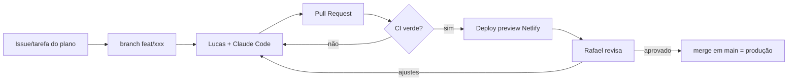

# Plano de Produção — Sistema Deguste Burguer

Baseado em [Sistema-Deguste-Burguer-Planejamento.md](Sistema-Deguste-Burguer-Planejamento.md) · versão 0.1 · 2026-09-18

> Este arquivo é o **documento vivo de acompanhamento**. Marque `[x]` conforme as tarefas forem concluídas (via commit/PR) e o painel em `localhost` atualiza o progresso sozinho.

**Como ler as tarefas:** cada uma termina com quem faz (`👤 Lucas`, `👤 Rafael + Lucas`…; o primeiro nome é o responsável principal) e, quando há, do que depende (`⏳ depende: 1.7` = só começa depois de 1.7 pronta). Para ver só as suas, rode `node painel/server.js`, abra <http://localhost:4173> e escolha seu nome em **Minhas tarefas**.

## 1. Objetivo e marco final

Substituir a Cardápio Web por uma plataforma própria (custo fixo R$ 0) **sem perder nenhuma capacidade operacional**: cardápio, pedidos, Pix, cozinha em tempo real, impressão automática e rota de entrega.

**Marco que define sucesso:** a *Fase 5 – Substituição real*. É quando a loja opera 100% no sistema novo e a mensalidade da Cardápio Web pode ser cancelada.

## 2. Premissas e decisões de produção

Decisões tomadas neste plano (o planejamento deixava em aberto ou implícito). Contestar agora é barato; depois, não.

| # | Decisão | Motivo |
| --- | --- | --- |
| D1 | **Um repositório só (monorepo)**: `app/` (React+Vite + Netlify Functions), `printer-agent/`, `supabase/` (migrations SQL), `docs/` | Lucas puxa um repo só; deploy do front e das functions juntos |
| D2 | **Schema versionado em migrations SQL** (Supabase CLI), nunca alterado só pelo painel do Supabase | Reprodutível, revisável em PR, restaurável |
| D3 | **Modelo de dados já nasce "channel-agnostic"**: todo item de pedido aponta para um `produto_id` real, mesmo dentro de combo, e todo pedido tem `canal` (`proprio`, `ifood`, `99food`) | Resolve desde o dia 1 o problema de relatório que a Cardápio Web não resolve (combos e mesmo hambúrguer em plataformas diferentes) |
| D4 | **Ambientes**: `main` = produção (Netlify), cada PR = deploy preview, projeto Supabase separado para `dev/staging` | Lucas nunca testa contra dados reais |
| D5 | **Fase 5 exige Cardápio Web rodando em paralelo** por 1–2 semanas | Rede de segurança já prevista no planejamento |
| D6 | **iFood/99Food ficam fora do caminho crítico**: operar pelos gestores de pedido nativos das plataformas até a Fase 7 | Já previsto; não bloqueia o MVP |
| D7 | **Sem contas de cliente no MVP**: pedido identificado por nome + telefone. Conta/cashback entram na Fase 6 | Reduz o MVP; cashback e cupom não são necessários para vender |

## 3. Visão geral das fases

Esforço em **dias de trabalho efetivo** (Rafael com Claude Code). Calendário depende da disponibilidade — ver seção 9.

| Fase | Entrega | Esforço | Critério de saída (verificável) |
| --- | --- | --- | --- |
| 0 | Setup: repo, ambientes, CI, contas | 2 d | PR de exemplo gera deploy preview; Lucas rodou o projeto local |
| 1 | Fundação: banco + admin de produtos | 5 d | Bruno/Lucas cadastram um produto pelo admin e ele aparece no banco |
| 2 | Cardápio público | 5 d | Cardápio real completo navegável no celular, abre/fecha por horário |
| 3 | Pedido + frete + Pix | 10 d | Pedido de teste pago no sandbox aparece como `pago` no banco |
| 4 | Cozinha em tempo real + impressão | 7 d | Pedido novo toca som, aparece na tela e **sai impresso** na impressora real |
| 5 | Substituição real (piloto → corte) | 2 semanas de operação | 10 dias de operação sem falha crítica; Cardápio Web cancelada |
| 6 | Extras: rota, WhatsApp, cashback, cupons, relatórios | 10 d | Cada extra em produção, individualmente |
| 7 | (Opcional) iFood / 99Food | a definir | Decisão de negócio após Fase 5 estável |

**Total até o começo da Fase 5: ~29 dias de trabalho.**

---

## Fase 0 — Setup e fundação de processo

**Objetivo:** qualquer pessoa clona o repo, roda em 10 minutos e abre um PR que gera preview.

- [x] 0.1 Criar repositório Git e enviar o link ao time `👤 Rafael`
- [ ] 0.2 Proteger `main`: PR obrigatório, 1 aprovação (Rafael), sem push direto `👤 Rafael`
  - Ao proteger, marcar também como **checks obrigatórios** os três jobs do CI: `app`, `banco` e `plano` (o `plano` garante que toda tarefa concluída seja marcada no plano, no mesmo PR).
  - Passo a passo e configuração pronta para importar: `docs/proteger-main.md` (`docs/ruleset-main.json`). Só o administrador do repositório (Rafael) consegue aplicar.
- [x] 0.3 Estrutura do monorepo (D1) + `README.md` com "como rodar em 10 minutos" `👤 Rafael`
- [x] 0.4 Projeto Vite + React + React Router + TypeScript `👤 Rafael`
- [x] 0.5 Lint + formatação + teste rodando em CI (GitHub Actions) a cada PR `👤 Rafael`
- [ ] 0.6 Site Netlify conectado ao repo: `main` → produção, PRs → deploy preview `👤 Rafael`
- [ ] 0.7 Dois projetos Supabase: `deguste-dev` e `deguste-prod` `👤 Lucas + Rafael`
  - Decisão: criados na **conta do Lucas**, porque o plano gratuito limita a 2 projetos por conta e a do Rafael já usa os 2.
  - Criar uma **organização** "Deguste Burguer" e **convidar o Rafael como Administrador**, para o banco não depender de uma pessoa só (ponto único de falha).
  - A senha do banco e a chave `service_role` ficam só com o Lucas (gerenciador de senhas); nunca no Git, chat ou `.env` versionado. A `service_role` vai direto nas variáveis do Netlify.
  - O Rafael precisa apenas de: URL do projeto e chave `anon` (públicas).
  - `deguste-prod` pode ser criado só perto do go-live (Fase 5); confirmar no painel se o limite de 2 projetos vale por conta ou por organização.
- [x] 0.8 `.env.example` documentado; `.gitignore` cobrindo `.env*`; segredos só no Netlify (segurança já definida no planejamento) `👤 Rafael`
- [x] 0.9 `CLAUDE.md` na raiz: convenções, comandos, regras do projeto, para o Claude Code de Lucas seguir as mesmas regras que o de Rafael `👤 Rafael`
- [x] 0.10 Template de PR (o que mudou, como testar, screenshot) e guia `CONTRIBUTING.md` para iniciante `👤 Rafael`
- [x] 0.11 Lucas clona, roda local e abre um primeiro PR trivial (ex.: corrigir um texto) — valida o fluxo inteiro `👤 Lucas`

**Saída:** PR do Lucas mergeado, deploy preview funcionando.

---

## Fase 1 — Fundação: banco e painel admin

**Objetivo:** dados modelados e cadastro de produtos funcionando.

**Banco (Supabase, via migrations):**

- [x] 1.1 Tabelas núcleo: `categorias`, `produtos`, `grupos_opcao` / `opcoes` (variações e adicionais do "monte o seu"), `configuracoes_loja` `👤 Rafael`
- [x] 1.2 Tabelas de pedido: `pedidos` (com `canal`, `tipo` entrega/retirada, `status`, `pagamento_status`), `itens_pedido`, `itens_pedido_componentes` (D3: combo resolvido em produtos reais), `clientes` (nome + telefone) `👤 Rafael`
- [x] 1.3 Tabelas reservadas para Fase 6 já desenhadas (`cupons`, saldo de cashback) mas **sem UI** — evita migração dolorosa depois `👤 Rafael`
- [x] 1.4 **RLS ativado em todas as tabelas desde o início**; políticas: público lê cardápio ativo; só admin autenticado escreve; pedidos só via função server-side `👤 Rafael`
- [x] 1.5 Seed com dados de exemplo para dev `👤 Rafael`
- [x] 1.6 Testes de RLS (anônimo não consegue ler `pedidos` nem `clientes`) `👤 Rafael`

**Admin:**

- [ ] 1.7 Login admin (Supabase Auth, e-mail + senha; 2 usuários: Bruno e Lucas) `👤 Rafael` `⏳ depende: 0.7`
- [ ] 1.8 CRUD de categorias (ordem, ativo/inativo) `👤 Lucas` `⏳ depende: 1.7`
- [ ] 1.9 CRUD de produtos (nome, descrição, preço, foto, categoria, disponível/esgotado) `👤 Rafael` `⏳ depende: 1.7`
- [ ] 1.10 CRUD de grupos de opção e opções do "monte o seu" (mín/máx de escolhas, preço adicional) `👤 Rafael` `⏳ depende: 1.7`
- [ ] 1.11 Upload de fotos (Supabase Storage) com redimensionamento no cliente (economiza o free tier) `👤 Rafael` `⏳ depende: 1.7`
- [ ] 1.12 Configurações da loja: horário por dia da semana, aberta/fechada manual, taxa de entrega, raio `👤 Rafael` `⏳ depende: 1.7`

**Saída:** Bruno cadastra "Smash Jackfino" com foto pelo admin.

---

## Fase 2 — Cardápio público

**Objetivo:** cardápio real completo, bom no celular, em produção numa URL de teste.

- [ ] 2.1 **Levantar o cardápio completo real** (fotos, descrições, preços) — faltam *Entradas e Sobremesas*, *Bebidas* e *Ofertas com Desconto* `👤 Lucas + Bruno`
  - ✔ Levantamento entregue pelo Lucas (PR #1): itens, preços, descrições e opções conferidos com o relatório da Cardápio Web (`docs/levantamento-cardapio.md`).
  - Falta: fotos e `alt` (todas `?`); conferir por dentro 3 combos (Brownie+Bebida Grátis, 4 Smashs, Boladão); molho é "1" ou "1 a 2"?; Brownie de Chocolate saiu do cardápio ou volta?; perguntas para o Bruno (pedido mínimo, frete, raio, tempo, impressora, cashback, titular do CNPJ); tirar do texto o caminho pessoal `/home/lucas/...`.
- [ ] 2.2 Carga do cardápio real no banco de produção (script de seed, revisável em PR) `👤 Rafael` `⏳ depende: 2.1, 2.11, 2.12, 0.7`
- [x] 2.3 Página do cardápio: categorias, navegação por âncora, busca `👤 Rafael`
- [x] 2.4 Página/modal de produto com variações e adicionais ("monte o seu") respeitando mín/máx `👤 Rafael`
- [x] 2.5 Sacola (carrinho) persistida no navegador, com edição de itens `👤 Rafael`
- [x] 2.6 Loja abre/fecha automaticamente por horário (fuso `America/Bahia`); fora do horário, pedido bloqueado com aviso claro `👤 Rafael`
- [x] 2.7 Produto esgotado aparece bloqueado, não some `👤 Rafael`
- [ ] 2.8 Mobile-first + acessibilidade: contraste, `alt` em todas as fotos, foco/teclado (exigido no planejamento) `👤 Rafael + Lucas`
- [ ] 2.9 Performance: imagens otimizadas/lazy, Lighthouse mobile ≥ 90 `👤 Rafael`
- [ ] 2.10 Domínio (ou subdomínio Netlify) definido `👤 Lucas`
- [ ] 2.11 **Decidir e modelar escolhas repetidas em combos.** O "Combo 3 Smashs" pede escolher 3 entre 5 smashs: o cliente pode repetir o mesmo (2× Jackfino)? Se sim, opções precisam de **quantidade** (hoje o servidor recusa opção repetida). Mexe em `domain/pedido.ts`, `domain/carrinho.ts`, tela do produto e `itens_pedido_componentes` (migration); os relatórios por produto real precisam continuar somando certo `👤 Rafael + Bruno`
- [ ] 2.12 **Decidir preço "de/por".** Vários itens mostram preço riscado (ex.: Jackfino 22,99, de 27,99). Mostrar o desconto ou só o preço atual? Se mostrar: coluna de preço original (migration), exibição no cardápio, e o total continua usando **só** o preço atual `👤 Rafael + Bruno`

**Saída:** Bruno e Lucas navegam o cardápio inteiro no celular e aprovam preços/fotos.

---

## Fase 3 — Pedido, frete e Pix

**Objetivo:** cliente faz um pedido completo e paga. Nada de dinheiro real ainda (sandbox).

- [ ] 3.1 Decisão: gateway Pix — **Mercado Pago vs Pagar.me** (comparar taxa real, prazo de recebimento, qualidade do sandbox) `👤 Rafael + Lucas`
- [ ] 3.2 Conta do gateway criada em nome do CNPJ do Deguste, credenciais de sandbox nas variáveis do Netlify `👤 Lucas + Rafael` `⏳ depende: 3.1`
- [x] 3.3 Checkout: nome, telefone, entrega vs retirada, endereço, observações `👤 Rafael`
- [ ] 3.4 Geolocalização opcional do cliente (Geolocation API, com consentimento) para preencher endereço/calcular frete `👤 Rafael`
- [ ] 3.5 **Cálculo de frete**: geocoding + distância (OpenRouteService ou similar) aplicando a regra de cobrança (R$/km ou faixas de bairro) *(regra de preço: Lucas define)* `👤 Rafael + Lucas`
  - ✔ Pronto e testado (`app/src/domain/frete.ts`): três modelos de cobrança (por km, faixas de km, por bairro), raio máximo, recusa em vez de chutar preço.
  - Falta: serviço de geocodificação/rotas real (OpenRouteService) e a regra definitiva da loja (P4).
- [ ] 3.6 Validação de área de atendimento ("consulte localidades"): endereço fora do raio é recusado com mensagem `👤 Rafael`
- [ ] 3.7 Function `criar-pedido`: **recalcula preço e frete no servidor** (nunca confiar no valor vindo do navegador), **recusa pedido com a loja fechada ou opção obrigatória faltando** (o bloqueio da tela é só conveniência), grava pedido + itens + componentes `👤 Rafael`
  - ✔ Pronto e testado (`app/src/domain/pedido.ts`, `pedidoBanco.ts`): leitura defensiva da entrada, preço/frete/total calculados no servidor, recusas (loja fechada, esgotado, opção inválida, mínimo, fora da área) e linhas prontas para o banco, validadas contra o schema real em `supabase/tests/contrato-pedido.test.ts`.
  - Falta: a Netlify Function que lê o cardápio do Supabase (só itens ativos), chama essa lógica e grava (precisa do Supabase de dev, 0.7).
- [ ] 3.8 Function `gerar-pix`: cria cobrança no gateway, devolve QR code/copia-e-cola `👤 Rafael`
- [ ] 3.9 Function `webhook-pix`: valida assinatura do gateway, marca pedido `pago` de forma **idempotente** (webhook repetido não duplica nada) `👤 Rafael`
- [ ] 3.10 Tela de acompanhamento do pedido para o cliente (aguardando pagamento → pago → em preparo…), com timeout de Pix expirado `👤 Rafael`
  - ✔ Pronto: tela de pedido registrado com a linha do tempo (entrega e retirada) e revisão do total antes de confirmar (`app/src/pages/Checkout.tsx`).
  - Falta: status reais em tempo real (Supabase Realtime), Pix com QR code e expiração (3.8/3.9).
- [ ] 3.11 Rate limiting nas functions (anti-spam de pedidos falsos) `👤 Rafael`
- [ ] 3.12 Páginas legais publicadas: Política de Privacidade, Termos de Uso, Política de Cancelamento, FAQ, **banner de cookies** *(texto: Lucas com apoio jurídico/modelos; implementação: Rafael)* `👤 Lucas + Rafael`
- [ ] 3.13 LGPD: caminho para o cliente pedir exclusão dos dados (pode ser e-mail/WhatsApp documentado, mas precisa existir) `👤 Rafael + Lucas`
- [ ] 3.14 Testes automatizados do fluxo pedido→pagamento (incluindo webhook duplicado e pagamento após expiração) `👤 Rafael`

**Saída:** pedido de teste pago no sandbox vira `pago` no banco, com frete correto.

---

## Fase 4 — Cozinha em tempo real e impressão

**Objetivo:** pedido pago aparece na cozinha e sai impresso, sem ninguém tocar em nada.

**Painel da cozinha / gestão de pedidos:**

- [ ] 4.1 Painel de pedidos (Supabase Realtime): colunas por status (novo → em preparo → pronto → saiu → entregue/retirado) `👤 Rafael`
- [ ] 4.2 Alerta sonoro + destaque visual para pedido novo; funciona em tablet `👤 Rafael`
- [ ] 4.3 Aceitar/recusar pedido, marcar esgotado rápido, cancelar com motivo `👤 Rafael`
- [ ] 4.4 Reconexão automática do Realtime + indicador visível "conectado/desconectado" (cozinha precisa saber se está cega) `👤 Rafael`
- [ ] 4.5 Estimativa de tempo de preparo/entrega mostrada ao cliente `👤 Rafael`

**Agente de impressão (`printer-agent/`):**

- [ ] 4.6 **Confirmar modelo/marca da impressora térmica atual** — bloqueia a escolha da biblioteca ESC/POS `👤 Lucas`
- [ ] 4.7 Agente Node.js: autentica na API, escuta pedidos novos (Realtime ou polling), formata recibo ESC/POS (`node-thermal-printer`) `👤 Rafael` `⏳ depende: 4.6`
- [ ] 4.8 Layout do recibo aprovado por Bruno (itens, adicionais, observações em destaque, endereço, forma de pagamento, canal) `👤 Bruno + Lucas`
- [ ] 4.9 **Fila e confirmação de impressão**: pedido só é "impresso" quando o agente confirma; falha → retentativa → alerta no painel ("pedido #123 NÃO imprimiu") `👤 Rafael`
- [ ] 4.10 Reimpressão manual de qualquer pedido pelo painel `👤 Rafael`
- [ ] 4.11 Agente instalado como serviço que **inicia junto com o Windows e reinicia sozinho** se travar `👤 Rafael`
- [ ] 4.12 Guia de instalação/troubleshooting para a cozinha (1 página, com prints) — mitiga o "ponto único de manutenção" `👤 Rafael + Lucas`
- [ ] 4.13 Teste em condições reais: queda de internet, impressora sem papel/desligada, PC reiniciado `👤 Lucas + Rafael`

**Saída:** pedido de teste pago **sai impresso** na impressora real da cozinha.

---

## Fase 5 — Substituição real (piloto → corte)

**Objetivo:** operar de verdade e cancelar a Cardápio Web com segurança.

**Pré-requisitos de go-live (nenhum pode faltar):**

- [ ] 5.1 Gateway Pix migrado do **sandbox para produção**, com um pagamento real de R$ 1 testado e estornado `👤 Rafael + Lucas` `⏳ depende: 3.2`
- [ ] 5.2 Backup: exportação periódica do banco fora do Supabase + **restauração testada de verdade** em projeto vazio `👤 Rafael`
- [ ] 5.3 Monitoramento: alerta (e-mail/WhatsApp para Rafael) quando uma function falha ou o agente de impressão fica offline `👤 Rafael`
- [ ] 5.4 Mitigação do pause do Supabase free tier (projeto pausa após ~1 semana sem atividade — confirmar regra vigente; loja fecha seg/ter, mas feriado/férias podem passar disso) → rotina de "keep-alive" `👤 Rafael`
- [ ] 5.5 Plano de contingência impresso na cozinha: sistema fora → WhatsApp manual (número atual) + como avisar clientes `👤 Lucas + Bruno`
- [ ] 5.6 Runbook de incidentes (`docs/runbook.md`): "não imprime", "pedido não chegou", "Pix pago mas pedido não confirmou", quem acionar `👤 Rafael + Lucas`
- [ ] 5.7 Backup de hardware: impressora reserva ou plano B de impressão (imprimir pelo navegador no PC) `👤 Lucas`
- [ ] 5.8 Treinamento de Bruno e Lucas (30–45 min, no local) `👤 Rafael`

**Piloto:**

- [ ] 5.9 **Definir data de corte** e comunicar ao time `👤 Bruno + Lucas + Rafael`
- [ ] 5.10 Soft launch: link novo divulgado só para clientes fiéis/no Instagram Stories por 2–3 dias, Cardápio Web ainda principal `👤 Lucas`
- [ ] 5.11 Virada: link do Instagram/bio passa a apontar para o sistema novo; Cardápio Web fica **ativa em paralelo** (D5) `👤 Lucas + Rafael`
- [ ] 5.12 Operar 1–2 semanas de quarta a domingo; registrar cada falha em issue com severidade `👤 Lucas + Bruno`
- [ ] 5.13 Reunião de go/no-go: critérios abaixo atendidos → cancelar Cardápio Web `👤 Bruno + Lucas + Rafael`
- [ ] 5.14 Exportar dados de clientes/histórico da Cardápio Web *antes* de cancelar (dados são da Deguste) `👤 Lucas`

**Critério de go/no-go (todos verdadeiros):**

- 10 dias de operação, zero pedido perdido (todo pedido pago virou pedido na cozinha)
- Zero falha de impressão sem retentativa/alerta funcionando
- Todo Pix pago conciliado com o pedido
- Bruno e Lucas dizem que operam sem precisar de Rafael no dia a dia

---

## Fase 6 — Extras (paridade e melhorias)

Ordem sugerida por valor operacional. Cada item entra por PR próprio.

- [ ] 6.1 **Link de rota para o entregador** (Google Maps/Waze) por pedido, botão "copiar/enviar por WhatsApp" `👤 Rafael`
- [ ] 6.2 **Relatórios** de vendas dia/semana/mês, por canal, por horário de pico, produtos mais vendidos — **contando combos e canais pelo `produto_id` real** (D3) `👤 Rafael`
- [ ] 6.3 Histórico de pedidos por cliente (telefone) + clientes recorrentes `👤 Rafael`
- [ ] 6.4 **Mensagens automáticas de status por WhatsApp** — depende da decisão da seção 8 (custo!) `👤 Rafael`
- [ ] 6.5 Cupons de desconto (validade, uso único, valor mínimo, anti-abuso) `👤 Rafael`
- [ ] 6.6 Conta de cliente + cashback de 10% `👤 Rafael`
- [ ] 6.7 Gestão de motoboys: atribuir pedido, acompanhar entrega, cálculo do valor a pagar por entregador `👤 Rafael + Lucas`
- [ ] 6.8 Ficha técnica e custo por produto (base para margem e controle de estoque) `👤 Bruno + Lucas + Rafael`

---

## Fase 7 — (Opcional) iFood / 99Food

Só após Fase 5 estável e decisão de negócio (D6).

- [ ] 7.1 Pesquisar estado atual das APIs: iFood (programa de integração/homologação) e 99Food — **validar se o caminho "Open Delivery" do planejamento cobre de fato as duas** `👤 Rafael`
- [ ] 7.2 Cadastrar como parceiro/desenvolvedor e iniciar homologação `👤 Rafael`
- [ ] 7.3 Receber pedidos como `canal = ifood|99food`, mapear itens do marketplace → `produto_id` (tabela de equivalência) `👤 Rafael`
- [ ] 7.4 Sincronizar cancelamentos/alterações vindos das plataformas `👤 Rafael`
- [ ] 7.5 Impressão e relatórios idênticos aos do canal próprio `👤 Rafael`

---

## 4. Fluxo de trabalho Git (Rafael + Lucas)

Regras:

1. Nada vai direto para `main`. Todo trabalho = 1 branch + 1 PR, pequeno e focado (uma tarefa deste plano por PR).
2. Nome de branch: `feat/`, `fix/`, `docs/` + descrição curta. Commits em português ou inglês, mas consistentes.
3. PR referencia o ID da tarefa (ex.: "Fecha 1.8"). Ao mergear, quem mergeou marca `[x]` neste arquivo.
4. **Lucas nunca testa contra o banco de produção** (D4).
5. Mudanças de schema exigem migration + revisão obrigatória de Rafael.
6. Segredos jamais entram no Git; se vazar, rotacionar a chave imediatamente.
7. Tarefas para Lucas começar (baixo risco, alto valor): levantamento do cardápio (2.1), textos das páginas legais (3.12), layout do recibo (4.8), testes manuais de aceite em cada fase, `alt` das fotos.

## 5. Definição de "pronto" (vale para todo PR)

- [ ] CI verde (lint, tipos, testes)
- [ ] Testado no deploy preview, no **celular**
- [ ] Sem segredo no diff
- [ ] Nada de lógica de preço/pagamento só no cliente
- [ ] Se mexeu em dados: migration + RLS revisada
- [ ] Se mexeu em algo operacional (cozinha/impressão): testado na condição real ou justificado

## 6. Riscos de produção e mitigação

| Risco | Impacto | Mitigação no plano |
| --- | --- | --- |
| Pedido pago e não impresso | Cliente sem lanche, perda direta | 4.9, 4.10, 4.11, 5.7 |
| Pix pago sem pedido confirmado (webhook falhou) | Cobrança sem entrega | 3.9 (idempotência), 5.3 (alerta), 5.6 (runbook) |
| Rafael indisponível em pico | Loja para | 4.12, 5.6, Lucas treinado no fluxo, contingência 5.5 |
| Internet da casa cai | Tudo para | 5.5 (WhatsApp manual), sugestão: chip 4G como backup |
| Supabase pausa por inatividade | Site fora do ar | 5.4 |
| Free tier estoura | Custo inesperado | Monitorar uso mensalmente; fotos otimizadas (1.11, 2.9) |
| Lucas introduz bug em produção | Falha em pico | PR obrigatório (0.2), preview, ambientes separados (D4) |
| Relatório errado de vendas | Decisão de negócio errada | D3 desde o modelo de dados; teste com pedidos de combo (6.2) |
| Regras fiscais | Multa se o volume crescer | Fora do escopo; confirmar com contador e registrar decisão |

## 7. Pontos do planejamento que merecem atenção

Encontrados ao converter o planejamento em plano de produção:

1. **"Custo fixo R$ 0" não cobre WhatsApp automático.** Mensagens automáticas de status pela API oficial do WhatsApp (Meta) têm custo por conversa/template e exigem aprovação de templates. Alternativas gratuitas são semiautomáticas (botão "enviar no WhatsApp" que abre a conversa com texto pronto). Precisa de decisão (seção 8).
2. **Supabase free tier pausa projetos inativos** — ver 5.4.
3. **"Open Delivery" pode não ser o caminho real do iFood.** O iFood tem programa próprio de integração; validar antes de prometer (7.1). Por isso a Fase 7 é opcional e fora do caminho crítico.
4. **Conta com CNPJ**: o gateway de Pix normalmente exige cadastro do negócio (CNPJ e conta bancária). Confirmar quem é o titular antes da Fase 3.
5. **Dados dos clientes da Cardápio Web** (cashback/saldo atual dos clientes) precisam ser migrados ou honrados na virada — sem isso, clientes perdem saldo. Incluído em 5.14; decidir tratamento do saldo.

## 8. Decisões e informações pendentes (bloqueiam tarefas)

| # | Pendência | Quem | Bloqueia |
| --- | --- | --- | --- |
| P1 | ✅ Link do repositório Git (recebido) | Rafael | — |
| P2 | **Modelo/marca da impressora térmica** e sistema do PC/tablet da cozinha (Windows? tablet Android?) | Lucas | 4.6, 4.7 |
| P3 | Cardápio completo: Entradas e Sobremesas, Bebidas, Ofertas com Desconto (fotos, preços, descrições) | Lucas + Bruno | 2.1 |
| P4 | Regra de frete: R$/km, faixas de bairro ou mistura? Lista de bairros atendidos | Lucas | 3.5, 3.6 |
| P5 | Gateway Pix: Mercado Pago ou Pagar.me; em nome de quem (CNPJ) | Rafael + Lucas | 3.1, 3.2 |
| P6 | WhatsApp: semiautomático grátis ou API oficial paga? | Rafael + Lucas | 6.4 |
| P7 | Data de corte e duração do paralelo | Bruno + Lucas | 5.9 |
| P8 | Domínio próprio (~R$ 40/ano) ou subdomínio Netlify no início | Lucas | 2.10 |
| P9 | Como tratar o saldo de cashback atual dos clientes na virada | Bruno + Lucas | 5.14, 6.6 |
| P10 | Emissão de nota fiscal: conversar com o contador | Lucas | Fase 7 / fora de escopo |

## 9. Cronograma de referência

Considerando **~15 h/semana** do Rafael (~2 dias efetivos por semana). Ajustar se a disponibilidade for outra.

| Semana | Foco |
| --- | --- |
| 1–2 | Fase 0 + Fase 1 |
| 3–4 | Fase 2 (em paralelo, Lucas levanta o cardápio real) |
| 5–8 | Fase 3 (a mais longa: frete, Pix, páginas legais) |
| 9–11 | Fase 4 (incluindo testes reais na cozinha) |
| 12 | Pré-requisitos de go-live e treinamento |
| 13–14 | Fase 5: piloto e paralelo |
| 15+ | Corte, depois Fase 6 conforme prioridade |

**~14 semanas até o corte** nessa cadência. Estimativa de partida; recalibrar ao fim da Fase 1 com a velocidade real (incluindo a contribuição do Lucas).

## 10. Próximas ações imediatas

1. Rafael envia o link do repositório (P1).
2. Lucas descobre modelo da impressora (P2) e começa o levantamento do cardápio (P3).
3. Rafael executa a Fase 0.
4. Revisão deste plano por Bruno, Lucas e Rafael — decisões D1–D7 e pendências P1–P10.
