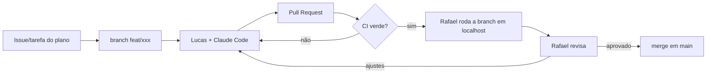

# Plano de Produção — Sistema Deguste Burguer

Baseado em [Sistema-Deguste-Burguer-Planejamento.md](Sistema-Deguste-Burguer-Planejamento.md) · versão 0.1 · 2026-09-18

> Este arquivo é o **documento vivo de acompanhamento**. Marque `[x]` conforme as tarefas forem concluídas (via commit/PR) e o painel em `localhost` atualiza o progresso sozinho.

**Como ler as tarefas:** cada uma termina com quem faz (`👤 Lucas`, `👤 Rafael + Lucas`…; o primeiro nome é o responsável principal) e, quando há, do que depende (`⏳ depende: 1.7` = só começa depois de 1.7 pronta). Para ver só as suas, rode `node painel/server.js`, abra <http://localhost:4173> e escolha seu nome em **Minhas tarefas**.

## 1. Objetivo e marco final

Substituir a Cardápio Web por uma plataforma própria (custo fixo R$ 0) **sem perder nenhuma capacidade operacional**: cardápio, pedidos, Pix, cozinha em tempo real, impressão automática e rota de entrega.

**Marco que define sucesso:** a *Fase 5 – Substituição real*. É quando a loja opera 100% no sistema novo e a mensalidade da Cardápio Web pode ser cancelada.

## 2. Premissas e decisões de produção

Decisões tomadas neste plano (o planejamento deixava em aberto ou implícito). Contestar agora é barato; depois, não.

| # | Decisão | Motivo |
| --- | --- | --- |
| D1 | **Um repositório só (monorepo)**: `app/` (React+Vite + Netlify Functions), `printer-agent/`, `supabase/` (migrations SQL), `docs/` | Lucas puxa um repo só; deploy do front e das functions juntos |
| D2 | **Schema versionado em migrations SQL** (Supabase CLI), nunca alterado só pelo painel do Supabase | Reprodutível, revisável em PR, restaurável |
| D3 | **Modelo de dados já nasce "channel-agnostic"**: todo item de pedido aponta para um `produto_id` real, mesmo dentro de combo, e todo pedido tem `canal` (`proprio`, `ifood`, `99food`) | Resolve desde o dia 1 o problema de relatório que a Cardápio Web não resolve (combos e mesmo hambúrguer em plataformas diferentes) |
| D4 | **Ambientes**: `main` = produção (Netlify, **só no fim**, ver D8), cada PR = deploy preview (idem), projeto Supabase separado para `dev/staging` | Lucas nunca testa contra dados reais |
| D5 | **Fase 5 exige Cardápio Web rodando em paralelo** por 1–2 semanas | Rede de segurança já prevista no planejamento |
| D6 | **iFood/99Food ficam fora do caminho crítico**: operar pelos gestores de pedido nativos das plataformas até a Fase 7 | Já previsto; não bloqueia o MVP |
| D7 | **Sem contas de cliente no MVP**: pedido identificado por nome + telefone. Conta/cashback entram na Fase 6 | Reduz o MVP; cashback e cupom não são necessários para vender |
| D8 | **Netlify fica para o FINAL do projeto** (21/09/2026, decisão do Rafael): até a preparação do go-live (5.16), desenvolvimento e testes rodam **em localhost** (site + functions + Supabase de dev). Sem deploy preview por PR; a revisão é local + CI | Evita custo/complexidade e configuração de infraestrutura enquanto o produto ainda está mudando; tudo o que é do Netlify vira uma tarefa única perto do go-live |

## 3. Visão geral das fases

Esforço em **dias de trabalho efetivo** (Rafael com Claude Code). Calendário depende da disponibilidade — ver seção 9.

| Fase | Entrega | Esforço | Critério de saída (verificável) |
| --- | --- | --- | --- |
| 0 | Setup: repo, ambientes, CI, contas | 2 d | Lucas rodou o projeto local e mesclou um PR (deploy preview no Netlify fica para o fim: D8) |
| 1 | Fundação: banco + admin de produtos | 5 d | Bruno/Lucas cadastram um produto pelo admin e ele aparece no banco |
| 2 | Cardápio público | 5 d | Cardápio real completo navegável no celular, abre/fecha por horário |
| 3 | Pedido + frete + Pix | 10 d | Pedido de teste pago no sandbox aparece como `pago` no banco |
| 4 | Cozinha em tempo real + impressão | 7 d | Pedido novo toca som, aparece na tela e **sai impresso** na impressora real |
| 5 | Substituição real (piloto → corte) | 2 semanas de operação | 10 dias de operação sem falha crítica; Cardápio Web cancelada |
| 6 | Extras: rota, WhatsApp, cashback, cupons, relatórios | 10 d | Cada extra em produção, individualmente |
| 7 | (Opcional) iFood / 99Food | a definir | Decisão de negócio após Fase 5 estável |

**Total até o começo da Fase 5: ~29 dias de trabalho.**

---

## Fase 0 — Setup e fundação de processo

**Objetivo:** qualquer pessoa clona o repo, roda em 10 minutos **em localhost** e abre um PR revisado pelo CI. (Publicação no Netlify e deploy preview ficam para o fim: D8.)

- [x] 0.1 Criar repositório Git e enviar o link ao time `👤 Rafael`
- [x] 0.2 Proteger `main`: PR obrigatório, 1 aprovação (Rafael), sem push direto `👤 Rafael`
  - Ao proteger, marcar também como **checks obrigatórios** os três jobs do CI: `app`, `banco` e `plano` (o `plano` garante que toda tarefa concluída seja marcada no plano, no mesmo PR).
  - Passo a passo e configuração pronta para importar: `docs/proteger-main.md` (`docs/ruleset-main.json`). Só o administrador do repositório (Rafael) consegue aplicar.
- [x] 0.3 Estrutura do monorepo (D1) + `README.md` com "como rodar em 10 minutos" `👤 Rafael`
- [x] 0.4 Projeto Vite + React + React Router + TypeScript `👤 Rafael`
- [x] 0.5 Lint + formatação + teste rodando em CI (GitHub Actions) a cada PR `👤 Rafael`
- [ ] 0.6 Site Netlify conectado ao repo: `main` → produção, PRs → deploy preview `👤 Rafael`
  - ⏸ **ADIADA por decisão do Rafael (21/09/2026) — só perto do go-live (D8).** Até lá tudo roda em localhost. Executar junto com a **5.16**. Enquanto isso, não há preview por PR: quem revisa roda a branch localmente e confere o CI.
  - Ao criar o site, cadastrar em Environment variables: `SUPABASE_URL`, `SUPABASE_SERVICE_ROLE_KEY` (secreta: só no Netlify) e, se a regra de frete for por distância, `ORS_API_KEY`. Detalhes em `docs/arquitetura-pedido.md`.
  - **Tentativa do Lucas (19/09/2026):** criou conta no Netlify e tentou importar o repositório, mas `deguste-system` não aparece na lista — é da conta do Rafael no GitHub, só ele consegue autorizar o app do Netlify a acessar esse repositório específico (permissão do GitHub, não trava do Netlify). **Ação do Rafael:** ou (a) autorizar o Netlify GitHub App para o repositório em github.com/settings/installations, ou (b) criar o site ele mesmo e depois convidar o Lucas como membro do time no Netlify.
  - `VITE_SUPABASE_URL` e `VITE_SUPABASE_ANON_KEY` (públicas) também precisam ir nas Environment variables, senão o site publicado não conecta no banco — mesmos valores do `app/.env.local` do Lucas.
  - Como o `deguste-prod` ainda não existe (0.7), o site de produção do Netlify vai apontar pro `deguste-dev` por enquanto — trocar quando o `deguste-prod` for criado, perto do go-live.
- [ ] 0.7 Dois projetos Supabase: `deguste-dev` e `deguste-prod` `👤 Lucas + Rafael`
  - Decisão: criados na **conta do Lucas**, porque o plano gratuito limita a 2 projetos por conta e a do Rafael já usa os 2.
  - `deguste-dev` ✅ criado (organização "Deguste Burguer", região São Paulo, plano Free). Todas as migrations de `supabase/migrations/` aplicadas, RLS ativo nas 13 tabelas, seed de exemplo carregado. Falta ainda: convidar o Rafael como Administrador na organização e criar o `deguste-prod` (perto do go-live, Fase 5).
  - Criar uma **organização** "Deguste Burguer" e **convidar o Rafael como Administrador**, para o banco não depender de uma pessoa só (ponto único de falha).
  - A senha do banco e a chave `service_role` ficam só com o Lucas (gerenciador de senhas); nunca no Git, chat ou `.env` versionado. A `service_role` vai direto nas variáveis do Netlify.
  - O Rafael precisa apenas de: URL do projeto e chave `anon` (públicas).
  - `deguste-prod` pode ser criado só perto do go-live (Fase 5); confirmar no painel se o limite de 2 projetos vale por conta ou por organização.
- [x] 0.8 `.env.example` documentado; `.gitignore` cobrindo `.env*`; segredos só no Netlify (segurança já definida no planejamento) `👤 Rafael`
- [x] 0.9 `CLAUDE.md` na raiz: convenções, comandos, regras do projeto, para o Claude Code de Lucas seguir as mesmas regras que o de Rafael `👤 Rafael`
- [x] 0.10 Template de PR (o que mudou, como testar, screenshot) e guia `CONTRIBUTING.md` para iniciante `👤 Rafael`
- [x] 0.11 Lucas clona, roda local e abre um primeiro PR trivial (ex.: corrigir um texto) — valida o fluxo inteiro `👤 Lucas`

- [ ] 0.12 **Rodar as functions localmente** (`pedidos`, `gerar-pix`, `webhook-pix`, `expirar-pedidos`) junto com o site em localhost, lendo um `.env` local do servidor (nunca no Git), para testar pedido e Pix de ponta a ponta sem Netlify (D8). Hoje o desenvolvimento usa a API simulada; sem esta tarefa, 3.15 e o teste de Pix no sandbox não têm onde rodar. Opções: `netlify dev` (CLI, sem publicar nada) ou um middleware no Vite que monte os mesmos handlers. Webhook do gateway em localhost precisa de um túnel temporário (ex.: cloudflared/ngrok) ou de consulta manual pelo botão "Já paguei" `👤 Rafael`

**Saída:** PR do Lucas mergeado, projeto rodando em localhost (site e functions).

---

## Fase 1 — Fundação: banco e painel admin

**Objetivo:** dados modelados e cadastro de produtos funcionando.

**Banco (Supabase, via migrations):**

- [x] 1.1 Tabelas núcleo: `categorias`, `produtos`, `grupos_opcao` / `opcoes` (variações e adicionais do "monte o seu"), `configuracoes_loja` `👤 Rafael`
- [x] 1.2 Tabelas de pedido: `pedidos` (com `canal`, `tipo` entrega/retirada, `status`, `pagamento_status`), `itens_pedido`, `itens_pedido_componentes` (D3: combo resolvido em produtos reais), `clientes` (nome + telefone) `👤 Rafael`
- [x] 1.3 Tabelas reservadas para Fase 6 já desenhadas (`cupons`, saldo de cashback) mas **sem UI** — evita migração dolorosa depois `👤 Rafael`
- [x] 1.4 **RLS ativado em todas as tabelas desde o início**; políticas: público lê cardápio ativo; só admin autenticado escreve; pedidos só via função server-side `👤 Rafael`
- [x] 1.5 Seed com dados de exemplo para dev `👤 Rafael`
- [x] 1.6 Testes de RLS (anônimo não consegue ler `pedidos` nem `clientes`) `👤 Rafael`

**Admin:**

- [ ] 1.7 Login admin (Supabase Auth, e-mail + senha; 2 usuários: Bruno e Lucas) `👤 Rafael` `⏳ depende: 0.7`
  - ✔ Pronto e testado: página de login, porteiro do `/admin` (não logado / logado sem permissão / admin), sessão persistente, mensagens sem revelar quem tem conta, `noindex` (`app/src/pages/Admin.tsx`, `state/AuthProvider.tsx`). Conferido contra o Supabase real com credencial falsa.
  - Falta: criar os usuários e liberar em `admins`, e testar o login de verdade. Passo a passo em `docs/criar-admins.md`.
- [x] 1.8 CRUD de categorias (ordem, ativo/inativo) `👤 Lucas` `⏳ depende: 1.7`
  - ✔ Tela `/admin/categorias`: criar, editar, ativar/desativar, reordenar com setas ▲▼ e excluir (só categoria vazia, com confirmação). Feita por Rafael/Claude com testes; falta só o teste com o banco real quando os admins existirem (1.7). Ver `docs/admin-cadastro.md`.
- [x] 1.9 CRUD de produtos (nome, descrição, preço, foto, categoria, disponível/esgotado) `👤 Rafael` `⏳ depende: 1.7`
  - ✔ Tela `/admin/produtos`: criar/editar (preço digitado em reais → centavos, preço "de", combo, ativo), **marcar esgotado com um toque**, reordenar dentro da categoria, filtro por categoria. A **foto** é a 1.11.
- [x] 1.10 CRUD de grupos de opção e opções do "monte o seu" (mín/máx de escolhas, preço adicional) `👤 Rafael` `⏳ depende: 1.7`
  - ✔ Botão **Opções** em cada produto (`/admin/produtos/:id/opcoes`): grupos com mínimo/máximo ("Obrigatório: escolha 1", "Opcional, até 3"), opções com valor adicional, **vínculo com produto real nas opções de combo** (D3), esgotado rápido por opção, reordenar e excluir com confirmação (pedidos antigos não mudam: nome e preço são copiados para o pedido).
- [x] 1.11 Upload de fotos (Supabase Storage) com redimensionamento no cliente (economiza o free tier) `👤 Rafael` `⏳ depende: 1.7`
  - ✔ No formulário de edição do produto: escolher/trocar/remover foto. A foto é **reduzida no navegador** (lado maior 1000 px, WebP ~80%: um PNG de 5,4 MB virou 147 KB, conferido num navegador de verdade) e vai para o bucket público `fotos-produtos` (limite 1 MB, só WebP/JPEG; só admin grava, testado). Troca apaga a foto antiga; falha ao gravar no produto apaga o arquivo enviado (sem lixo). O cardápio público passa a mostrar a foto (com `alt` = nome do produto). Precisa da migration `20260918200000` no banco (1.14).
- [x] 1.12 Configurações da loja: horário por dia da semana, aberta/fechada manual, taxa de entrega, raio `👤 Rafael` `⏳ depende: 1.7`
  - ✔ Tela `/admin/loja`: modo (seguir horários / aberta / fechada agora), horários por dia com vários intervalos, tempo de preparo, pedido mínimo, taxa base + valor por km, raio, endereço e coordenadas. Grava tudo numa **única função atômica** do banco (`salvar_configuracao_loja`): erro em qualquer parte não muda nada. Precisa da migration `20260918190000` no banco (1.14). A cozinha já usa o tempo de preparo configurado.
- [x] 1.13 **Desligar o cadastro público de usuários** no Supabase (Authentication → Allow new users to sign up), em dev e depois em prod. Achado: no `deguste-dev` está ligado, então qualquer pessoa consegue criar conta com a chave pública. Passo a passo em `docs/criar-admins.md` `👤 Lucas`
  - **Feito no `deguste-dev`** (18/09/2026, Lucas). Repetir em `deguste-prod` quando esse projeto for criado (perto do go-live, Fase 5).
- [x] 1.14 **Aplicar no `deguste-dev` as migrations pendentes** listadas em `docs/migrations-aplicadas.md` (SQL Editor, em ordem, uma vez cada) e marcar lá `👤 Lucas`
  - Feito (19/09/2026): as 8 migrations pendentes aplicadas via conector Supabase (não pelo SQL Editor manual, mas mesmo efeito). `deguste-dev` agora está com o schema igual ao repositório. `supabase/tests` (140 testes) e `get_advisors` conferidos depois — sem achado novo além dos avisos já esperados (funções `SECURITY DEFINER` com checagem própria de permissão).

**Saída:** Bruno cadastra "Smash Jackfino" com foto pelo admin.

---

## Fase 2 — Cardápio público

**Objetivo:** cardápio real completo, bom no celular, em produção numa URL de teste.

- [x] 2.1 **Levantar o cardápio completo real** (descrições, preços, opções e combos) `👤 Lucas + Bruno`
  - Feito em `docs/levantamento-cardapio.md`: todas as categorias (Ofertas com Desconto, Smashs, Burguers, Entradas e Sobremesas, Bebidas), grupos de opção do "monte o seu" e a estrutura completa dos 6 combos — os 3 que faltavam conferir por dentro (Brownie+Bebida Grátis, 4 Smashs, Boladão) já foram abertos e documentados. Conferido direto no site + relatório oficial de produtos.
  - **Fotos ficaram de fora por decisão do Lucas** (18/09/2026): não bloqueiam a 2.2 nem o resto da Fase 2 (o banco aceita `foto_path` nulo — chega com o upload, tarefa 1.11). Acompanhar em 2.13.
  - Ainda em aberto, sem bloquear nada (perguntas registradas em `docs/levantamento-cardapio.md`, seção "Perguntas em aberto"): grupo "Molho" aceita 1 ou até 2 opções (o site mostra contador inconsistente); pedido mínimo, regra de frete/raio, tempo de preparo, impressora térmica, saldo de cashback e titular do CNPJ (pendências P2/P4/P5/P9 da seção 8). "Brownie de Chocolate" resolvido em 2.14.
- [x] 2.2 Carga do cardápio real no banco de **desenvolvimento** (script de seed, revisável em PR) — permite testar o app com dados verdadeiros antes do go-live `👤 Rafael` `⏳ depende: 2.1, 2.11, 2.12, 2.14`
  - **Feito (Lucas, 19/09/2026):** `supabase/seed-cardapio-real.sql` — remove o cardápio de exemplo e carrega os 35 produtos reais (5 categorias, 6 combos, 34 grupos de opção, 158 opções), a partir de `docs/levantamento-cardapio.md`. Aplicado no `deguste-dev` via conector Supabase. Testado ao vivo no app: cardápio completo carregando do banco, combo "3 Smashs" com repetição de sabor e upsell opcional funcionando ponta a ponta.
  - Simplificações registradas no próprio script (revisar com o Bruno): grupo "Molho" com min 1/max 2; "Batata Trips com cheddar/aioli" apontam para o mesmo produto avulso "Batata Trips"; combos "Jackfino"/"Boladão" ganharam um grupo de 1 opção obrigatória só para o hambúrguer contar nos relatórios (D3).
  - Fotos ficam de fora por ora (`foto_path` nulo em todos) — tarefa 2.13.
- [x] 2.3 Página do cardápio: categorias, navegação por âncora, busca `👤 Rafael`
- [x] 2.4 Página/modal de produto com variações e adicionais ("monte o seu") respeitando mín/máx `👤 Rafael`
- [x] 2.5 Sacola (carrinho) persistida no navegador, com edição de itens `👤 Rafael`
- [x] 2.6 Loja abre/fecha automaticamente por horário (fuso `America/Bahia`); fora do horário, pedido bloqueado com aviso claro `👤 Rafael`
- [x] 2.7 Produto esgotado aparece bloqueado, não some `👤 Rafael`
- [x] 2.8 Mobile-first + acessibilidade: contraste, `alt` em todas as fotos, foco/teclado (exigido no planejamento) `👤 Rafael + Lucas`
  - ✔ Auditoria automática permanente: `axe-core` em 15 telas (`app/src/test/acessibilidade.test.tsx`) e contraste WCAG dos dois temas (`contraste.test.ts`). Corrigido: bordas de campos (1,2:1 → 4:1), regiões de leitura do cardápio e `<header>`/`<footer>` duplicados nos diálogos. Ver `docs/acessibilidade.md`.
  - Restam, em tarefas próprias: teste manual (2.16, Lucas) e `alt` das fotos (2.13).
- [x] 2.9 Performance: imagens otimizadas/lazy, Lighthouse mobile ≥ 90 `👤 Rafael`
  - ✔ Medido com Lighthouse mobile: **desempenho 94–97**, acessibilidade 100, boas práticas 100, SEO 100. Feito: carregamento sob demanda das rotas, bibliotecas em pacotes separados (cache), correção do deslocamento de layout (nota 78 → 97), miniatura de 320 px nas fotos dos cartões, descrição e `robots.txt`. Detalhes em `docs/desempenho.md`. Falta só medir de novo no Netlify e com fotos reais (2.13).
- [x] 2.10 Domínio (ou subdomínio Netlify) definido `👤 Lucas`
  - **Decidido (Lucas, 19/09/2026):** começar com o **subdomínio gratuito da Netlify** (ex.: `deguste-burguer.netlify.app`, nome exato a confirmar quando o site existir, tarefa 0.6) — consistente com a premissa do projeto de **custo fixo R$ 0**. Domínio próprio (~R$ 40/ano) fica como opção **futura e opcional**, sem custo nem decisão urgente agora; pode ser comprado e apontado a qualquer momento sem quebrar nada.
- [x] 2.11 **Decidir e modelar escolhas repetidas em combos.** O "Combo 3 Smashs" pede escolher 3 entre 5 smashs: o cliente pode repetir o mesmo (2× Jackfino)? Se sim, opções precisam de **quantidade** (hoje o servidor recusa opção repetida). Mexe em `domain/pedido.ts`, `domain/carrinho.ts`, tela do produto e `itens_pedido_componentes` (migration); os relatórios por produto real precisam continuar somando certo `👤 Rafael + Bruno`
  - **Decidido:** sim, pode repetir (Lucas, 18/09/2026 — dispensou aprovação do Rafael nesse item específico). Sem migration: `itens_pedido_componentes.quantidade` já suportava isso. Implementado em `domain/pedido.ts` (agrega repetições por opção) e na tela do produto (contador +/- em grupos com máximo > 1, em vez de check/radio).
- [x] 2.12 **Decidir preço "de/por".** Vários itens mostram preço riscado (ex.: Jackfino 22,99, de 27,99). Mostrar o desconto ou só o preço atual? Se mostrar: coluna de preço original (migration), exibição no cardápio, e o total continua usando **só** o preço atual `👤 Rafael + Bruno`
  - **Decidido:** mostrar o "de/por" (Lucas, 18/09/2026, opção recomendada — igual ao site atual). Migration `20260918140000_preco_original_produto.sql` (`produtos.preco_original_centavos`, nunca usado no total); exibido no card e no modal do produto com selo de desconto.
- [x] 2.17 **Redesign visual** da interface no padrão de apps de delivery, na paleta preto e branco da Deguste (mesma estrutura, telas e regras): capa e avatar da marca, busca e categorias em chips, cartão de produto com foto grande e botão "+", barra de sacola flutuante, folhas que sobem de baixo, fonte Inter embutida, **tema claro fixo**. Acessibilidade e desempenho mantidos (WCAG AA por teste; Lighthouse mobile 96/100/100/100). Detalhes em `docs/design.md` `👤 Rafael`
- [ ] 2.13 Fotos reais dos produtos: reunir/tirar, salvar numa pasta compartilhada (Drive) e preencher os nomes de arquivo em `docs/levantamento-cardapio.md` `👤 Lucas + Bruno`
- [ ] 2.16 **Teste manual de acessibilidade no celular:** só teclado, leitor de tela (TalkBack/VoiceOver), zoom 200% e fonte grande, sol forte. Checklist em `docs/acessibilidade.md` `👤 Lucas`
- [x] 2.14 **Decidir e modelar o Brownie de Chocolate.** Está "Inativo" como item avulso, mas aparece como sobremesa dentro dos combos. Hoje, no nosso sistema, uma opção que aponta para produto inativo é tratada como **esgotada** (não some, aparece bloqueada). Se for exclusivo de combo, precisamos separar "aparece no cardápio" de "pode ser vendido como parte de combo"; se for resquício, sai das opções antes da carga (2.2) `👤 Rafael + Bruno`
  - **Decidido (provisório, Lucas, 19/09/2026):** tratado como resquício — não entrou nem como item avulso, nem como opção de sobremesa em nenhum combo em `seed-cardapio-real.sql` (2.2). Só sobrevive "Brownie de Ninho". **O Bruno pode reverter** se "Brownie de Chocolate" ainda for pra vender (aí volta como item ativo antes da próxima carga).
- [ ] 2.15 Carga do cardápio real no banco de **produção** (mesmo script da 2.2, só depois de o `deguste-prod` existir) `👤 Rafael` `⏳ depende: 2.2, 0.7`

**Saída:** Bruno e Lucas navegam o cardápio inteiro no celular e aprovam preços/fotos.

---

## Fase 3 — Pedido, frete e Pix

**Objetivo:** cliente faz um pedido completo e paga. Nada de dinheiro real ainda (sandbox).

- [ ] 3.1 Decisão: gateway Pix — **Mercado Pago vs Pagar.me** (comparar taxa real, prazo de recebimento, qualidade do sandbox) `👤 Rafael + Lucas`
- [ ] 3.2 Conta do gateway criada em nome do CNPJ do Deguste, credenciais de sandbox num `.env` **local** do servidor de functions (fora do Git; vão para as variáveis do Netlify só na 5.16) `👤 Lucas + Rafael` `⏳ depende: 3.1`
- [x] 3.3 Checkout: nome, telefone, entrega vs retirada, endereço, observações `👤 Rafael`
- [ ] 3.4 Geolocalização opcional do cliente (Geolocation API, com consentimento) para preencher endereço/calcular frete `👤 Rafael`
- [ ] 3.5 **Cálculo de frete**: geocoding + distância (OpenRouteService ou similar) aplicando a regra de cobrança (R$/km ou faixas de bairro) *(regra de preço: Lucas define)* `👤 Rafael + Lucas`
  - ✔ Provedor de distância implementado (`app/src/server/distanciaOrs.ts`, OpenRouteService: geocodifica e calcula rota; chave no cabeçalho; qualquer falha recusa o pedido em vez de chutar frete). Testado com respostas simuladas.
  - Falta: validar com a `ORS_API_KEY` real e o endereço da loja com coordenadas, e a regra definitiva (P4).
  - ✔ Pronto e testado (`app/src/domain/frete.ts`): três modelos de cobrança (por km, faixas de km, por bairro), raio máximo, recusa em vez de chutar preço.
  - Falta: serviço de geocodificação/rotas real (OpenRouteService) e a regra definitiva da loja (P4).
- [ ] 3.6 Validação de área de atendimento ("consulte localidades"): endereço fora do raio é recusado com mensagem `👤 Rafael`
- [x] 3.7 Function `criar-pedido`: **recalcula preço e frete no servidor** (nunca confiar no valor vindo do navegador), **recusa pedido com a loja fechada ou opção obrigatória faltando** (o bloqueio da tela é só conveniência), grava pedido + itens + componentes `👤 Rafael`
  - ✔ Função pronta e testada (164 testes do app + 50 do banco): `app/src/server/pedidosHandler.ts` + `app/netlify/functions/pedidos.ts`. Empacotada com esbuild e chamada em Node (405 / 503 sem configuração / 400). Recalcula preço e frete, recusa loja fechada, esgotado e opção faltando, ignora preço vindo do navegador, grava pelo `criar_pedido` (atômico) e não vaza detalhe interno. Ver `docs/arquitetura-pedido.md`.
  - A verificação de ponta a ponta contra o banco real é a tarefa 3.15.
- [ ] 3.8 Function `gerar-pix`: cria cobrança no gateway, devolve QR code/copia-e-cola `👤 Rafael`
  - ✔ Lado do banco pronto e testado: `registrar_cobranca_pix` (idempotente, uma cobrança por pedido) e `acompanhar_pedido` devolvendo o Pix e o prazo. Ver `docs/pagamento.md`.
  - ✔ Function `gerar-pix` (`app/src/server/pix/`): valor sempre do banco, devolve o mesmo Pix se pedir de novo, limite por IP, erro do gateway sem vazar detalhe; adaptador do Mercado Pago (candidato) atrás de uma interface de gateway. Testada com gateway simulado e o banco real.
  - ✔ **Tela do Pix** na página do pedido: QR desenhado no navegador (conferido com um leitor de QR de verdade), copia e cola, prazo, "Já paguei", prazo vencido e falha com "tentar de novo". Ver `docs/pagamento.md`.
  - Falta: validar no **sandbox real** (depende de 3.1/3.2).
- [ ] 3.9 Function `webhook-pix`: valida assinatura do gateway, marca pedido `pago` de forma **idempotente** (webhook repetido não duplica nada) `👤 Rafael`
  - ✔ Lado do banco pronto e testado: `confirmar_pagamento_pix` idempotente, com trava de valor exato e tratamento de pagamento após cancelamento/expiração (vai para estorno, não para a cozinha). Ver `docs/pagamento.md`.
  - ✔ Function `webhook-pix`: confere a assinatura (HMAC), **consulta o gateway** em vez de confiar no aviso, confirma no banco; repetição = 200; falha = 502 para o gateway tentar de novo. Função agendada `expirar-pedidos` (a cada 5 min).
  - Falta: validar a assinatura e o formato com o **sandbox real** do Mercado Pago (depende de 3.1/3.2).
- [x] 3.10 Tela de acompanhamento do pedido para o cliente (aguardando pagamento → pago → em preparo…), com timeout de Pix expirado `👤 Rafael`
  - ✔ Pronto e testado: página `/acompanhar/<token>` (`app/src/pages/Acompanhar.tsx`) sobre `acompanhar_pedido` do banco. Atualiza a cada 10 s (pausa em segundo plano, atualiza ao voltar, para quando termina), mantém o último status se a rede falhar, trata cancelado e Pix expirado, e anuncia mudanças a leitores de tela. O checkout entrega o link ao confirmar. Modo simulado para desenvolvimento (`docs/arquitetura-pedido.md`).
  - A expiração real do Pix e a confirmação do pagamento chegam com 3.8 e 3.9; a tela já mostra os estados `expirado`, `falhou` e `pago`.
- [x] 3.11 Rate limiting nas functions (anti-spam de pedidos falsos) `👤 Rafael`
  - ✔ Banco: até 3 pedidos aguardando pagamento por telefone em 15 min. Função: 6 confirmações e 30 cálculos por minuto por IP e corpo de no máximo 20 KB. Testado.
  - Limite: o do IP vale por instância da função (best-effort); o do telefone vale para todos, pois fica no banco.
- [ ] 3.12 Páginas legais publicadas: Política de Privacidade, Termos de Uso, Política de Cancelamento, FAQ, **banner de cookies** *(texto: Lucas com apoio jurídico/modelos; implementação: Rafael)* `👤 Lucas + Rafael`
  - Estrutura implementada pelo Rafael (`app/src/pages/legal/`, `docs/paginas-legais.md`). Lucas resolveu 7 das 11 pendências (19/09/2026): razão social, canal/encarregado LGPD, prazos de reembolso e reclamação, regras de cancelamento e cliente ausente aprovadas, e forma de pagamento (Pix + pagamento na entrega em dinheiro/cartão — **atenção Rafael**: isso precisa de uma opção nova no checkout, hoje ele só cobre Pix).
  - Ainda falta pra "publicar" de verdade (tirar do modo rascunho): gateway Pix (3.1), serviço de mapas/rotas (3.5), prazo de retenção de dados (Lucas + contador) e revisão jurídica final de todo o texto.
  - ✔ Rascunho implementado e testado: Política de Privacidade, Termos de Uso, Cancelamento e reembolso, FAQ, rodapé com identificação do negócio e aviso de cookies (`app/src/pages/legal/`, `app/src/config/negocio.ts`). Todas as páginas mostram "Rascunho em revisão" até a trava `CONTEUDO_LEGAL_REVISADO` ser ligada.
  - Falta: decidir as pendências (P11 e P12 e a lista em `docs/paginas-legais.md`), revisão jurídica e virar a trava. O teste impede publicar com "[a definir]" restante.
- [ ] 3.13 LGPD: caminho para o cliente pedir exclusão dos dados (pode ser e-mail/WhatsApp documentado, mas precisa existir) `👤 Rafael + Lucas`
  - ✔ Parte técnica e procedimento prontos e testados: `exportar_dados_cliente` (acesso/portabilidade) e `anonimizar_cliente` (eliminação, mantendo pedidos sem dado pessoal; recusa se houver pedido em andamento). Roteiro para a equipe em `docs/lgpd-direitos.md`.
  - Falta: definir e publicar o **canal** para o cliente pedir (P11) e a revisão jurídica; aplicar a migration no dev (1.14).
- [x] 3.14 Testes automatizados do fluxo pedido→pagamento (incluindo webhook duplicado e pagamento após expiração) `👤 Rafael`
  - ✔ Parcial: fluxo pedido → acompanhamento → cozinha de ponta a ponta com o handler real e o banco real (`supabase/tests/fluxo-completo.test.ts`), incluindo valores forjados, loja fechada, anti-spam e combo com escolha repetida somando vendas por produto real.
  - ✔ Parte do **banco** do pagamento testada (`supabase/tests/pagamento-pix.test.ts`, 21 testes): aviso duplicado, valor divergente, pagamento após cancelamento e após expiração, expiração automática, permissões.
  - ✔ **De ponta a ponta** (`supabase/tests/fluxo-pix.test.ts`, 8 testes): functions reais + banco real + gateway simulado, incluindo webhook duplicado (até simultâneo), assinatura falsa, valor divergente e pagamento após expiração.
  - Falta: repetir o cenário no **sandbox real** quando 3.2 existir.
- [ ] 3.15 **Verificar a criação de pedido de ponta a ponta no `deguste-dev`:** migration `pedido_atomico` aplicada (1.14), functions rodando localmente com `SUPABASE_SERVICE_ROLE_KEY` e `SUPABASE_URL` no `.env` local (0.12; Netlify só na 5.16), fazer um pedido de teste pelo site em localhost e conferir o registro no banco e o acompanhamento `👤 Rafael + Lucas` `⏳ depende: 1.14, 0.12`
- [ ] 3.16 **Pagamento na entrega (dinheiro/cartão com o entregador)**: Lucas decidiu aceitar (páginas legais já citam). Falta no sistema: opção no checkout; pedido vai para a cozinha **sem** pagamento confirmado (hoje só pedido pago aparece na cozinha e imprime); troco; relatórios ("venda = pago") e conferência do valor com o entregador; anti-abuso (pedido falso sem pagamento prévio: limite por telefone, talvez só para clientes recorrentes ou até certo valor). Decidir as regras com Bruno e Lucas antes de construir `👤 Rafael + Bruno + Lucas`

**Saída:** pedido de teste pago no sandbox vira `pago` no banco, com frete correto.

---

## Fase 4 — Cozinha em tempo real e impressão

**Objetivo:** pedido pago aparece na cozinha e sai impresso, sem ninguém tocar em nada.

**Painel da cozinha / gestão de pedidos:**

- [x] 4.1 Painel de pedidos (Supabase Realtime): colunas por status (novo → em preparo → pronto → saiu → entregue/retirado) `👤 Rafael`
  - ✔ Tela `/cozinha` (só admin): 3 colunas, cartão com itens, escolhas do combo, observações em destaque, cliente, endereço, tempo de espera e cor de atraso (70%/100% de 30 min); botão principal avança **uma etapa por vez**; mudança protegida contra conflito (se outra pessoa já mexeu, avisa e atualiza). Ver `docs/cozinha.md`.
- [x] 4.2 Alerta sonoro + destaque visual para pedido novo; funciona em tablet `👤 Rafael`
  - ✔ Três bipes ao chegar pedido novo, repetindo a cada 20 s enquanto houver pedido novo sem atendimento; botão "Ativar som" (o navegador só libera áudio após um toque) que lembra a escolha; layout de tablet. Falta só testar num tablet real (4.13).
- [x] 4.3 Aceitar/recusar pedido, marcar esgotado rápido, cancelar com motivo `👤 Rafael`
  - ✔ Aceitar, recusar e cancelar com motivo obrigatório (gravado no pedido) prontos e testados.
  - ✔ **Marcar esgotado rápido**: atalho "Marcar esgotado" no topo da cozinha leva à lista de produtos (1.9), com o botão de um toque.
- [x] 4.4 Reconexão automática do Realtime + indicador visível "conectado/desconectado" (cozinha precisa saber se está cega) `👤 Rafael`
  - ✔ Indicador no topo (vira faixa vermelha quando cai), a biblioteca reconecta sozinha e a tela ainda consulta o banco a cada 15 s e ao voltar para a aba; se a consulta falha, mantém os pedidos e avisa que podem estar desatualizados.
- [x] 4.5 Estimativa de tempo de preparo/entrega mostrada ao cliente `👤 Rafael`
  - ✔ Tempo de preparo (configurável em 1.12) aparece no **cardápio**, na **confirmação** do pedido e na **página do pedido** ("cerca de N min depois do pagamento confirmado, mais o tempo da entrega"; some quando o pedido fica pronto).
  - Evolução possível: somar o tempo de deslocamento pela distância (quando a 3.5 for validada com a chave real).

**Agente de impressão (`printer-agent/`):**

- [ ] 4.6 **Confirmar modelo/marca da impressora térmica atual** — bloqueia a escolha da biblioteca ESC/POS `👤 Lucas`
- [ ] 4.7 Agente Node.js: autentica na API, escuta pedidos novos (Realtime ou polling), formata recibo ESC/POS (`node-thermal-printer`) `👤 Rafael` `⏳ depende: 4.6`
  - ✔ Agente implementado e testado (`printer-agent/`, 43 testes): laço pega → imprime → confirma; transportes por rede (testado com servidor TCP de verdade, inclusive impressora que nunca fecha a conexão), impressora USB compartilhada do Windows e arquivo; acentos CP860 com modo ASCII de segurança; conta própria (sem `service_role`).
  - Falta: **testar em impressora real** (modelo: P2) e ligar no `deguste-dev` (conta do agente + migration da fila, 1.14).
- [ ] 4.8 Layout do recibo aprovado por Bruno (itens, adicionais, observações em destaque, endereço, forma de pagamento, canal) `👤 Bruno + Lucas`
  - ✔ Proposta de layout implementada (`printer-agent/src/recibo.js`) e um exemplo em `docs/impressao.md`. Falta o **Bruno aprovar** (ou pedir ajustes).
- [x] 4.9 **Fila e confirmação de impressão**: pedido só é "impresso" quando o agente confirma; falha → retentativa → alerta no painel ("pedido #123 NÃO imprimiu") `👤 Rafael`
  - ✔ Lado do banco pronto e testado (21 testes): entrada automática ao pagar, reserva de 90 s, confirmação obrigatória, tentativas com espera crescente, esgota em 5 e vira `falhou`, alerta em `impressoes_com_problema`. Ver `docs/impressao.md`.
  - ✔ Agente que consome a fila (4.7) e faixa de alerta na tela da cozinha ("N pedidos não saíram impressos", com botão Reimprimir) prontos. A validação com impressora real fica na 4.13.
- [x] 4.10 Reimpressão manual de qualquer pedido pelo painel `👤 Rafael`
  - ✔ Função `reimprimir_pedido` (só admin) pronta e testada; a reimpressão vem marcada no recibo.
  - ✔ Botão "Reimprimir" em cada cartão do painel da cozinha.
- [ ] 4.11 Agente instalado como serviço que **inicia junto com o Windows e reinicia sozinho** se travar `👤 Rafael`
  - ✔ `printer-agent/iniciar-agente.bat` religa o agente se ele fechar ou travar; passo a passo para iniciar com o Windows no `printer-agent/README.md`. Falta testar no PC da cozinha.
- [ ] 4.12 Guia de instalação/troubleshooting para a cozinha (1 página, com prints) — mitiga o "ponto único de manutenção" `👤 Rafael + Lucas`
  - ✔ Rascunho do guia (instalação, teste, tabela de problemas) em `printer-agent/README.md`. Falta validar na cozinha, com prints.
- [ ] 4.13 Teste em condições reais: queda de internet, impressora sem papel/desligada, PC reiniciado `👤 Lucas + Rafael`

**Saída:** pedido de teste pago **sai impresso** na impressora real da cozinha.

---

## Fase 5 — Substituição real (piloto → corte)

**Objetivo:** operar de verdade e cancelar a Cardápio Web com segurança.

**Pré-requisitos de go-live (nenhum pode faltar):**

- [ ] 5.1 Gateway Pix migrado do **sandbox para produção**, com um pagamento real de R$ 1 testado e estornado `👤 Rafael + Lucas` `⏳ depende: 3.2`
- [ ] 5.2 Backup: exportação periódica do banco fora do Supabase + **restauração testada de verdade** em projeto vazio `👤 Rafael`
- [ ] 5.3 Monitoramento: alerta (e-mail/WhatsApp para Rafael) quando uma function falha ou o agente de impressão fica offline `👤 Rafael`
- [ ] 5.4 Mitigação do pause do Supabase free tier (projeto pausa após ~1 semana sem atividade — confirmar regra vigente; loja fecha seg/ter, mas feriado/férias podem passar disso) → rotina de "keep-alive" `👤 Rafael`
  - ✔ Rotina diária no GitHub (`.github/workflows/manter-banco-ativo.yml`) que consulta o banco todo dia e **avisa por e-mail se ele não responder**; a consulta foi conferida contra o `deguste-dev` (HTTP 200). Passo a passo em `docs/manter-banco-ativo.md`.
  - Falta: o Rafael cadastrar as 2 variáveis no GitHub (`SUPABASE_URL` e `SUPABASE_ANON_KEY`, do projeto de **produção** quando existir).
- [ ] 5.5 Plano de contingência impresso na cozinha: sistema fora → WhatsApp manual (número atual) + como avisar clientes `👤 Lucas + Bruno`
  - ✔ Rascunho em `docs/contingencia.md` (aviso aos clientes, pedidos manuais no papel, Pix manual, entregas, volta ao normal). Falta preencher a chave Pix e os contatos, validar com o Bruno e imprimir.
- [ ] 5.6 Runbook de incidentes (`docs/runbook.md`): "não imprime", "pedido não chegou", "Pix pago mas pedido não confirmou", quem acionar `👤 Rafael + Lucas`
  - ✔ `docs/runbook.md`: 11 incidentes (não imprime, pedido não chegou, Pix pago sem confirmar, estorno, cozinha sem tempo real, site fora, loja aberta/fechada errado, cardápio errado, Supabase pausado, erro misterioso, LGPD) com "agora" e "investigar depois". Falta preencher a tabela de contatos.
- [ ] 5.7 Backup de hardware: impressora reserva ou plano B de impressão (imprimir pelo navegador no PC) `👤 Lucas`
- [ ] 5.8 Treinamento de Bruno e Lucas (30–45 min, no local) `👤 Rafael`
- [ ] 5.9 Ativar 2FA nas contas de serviço que guardam dados de clientes (Supabase, GitHub) — antes só de dev, sem pressa; obrigatório antes do go-live `👤 Lucas`

**Piloto:**

- [ ] 5.10 **Definir data de corte** e comunicar ao time `👤 Bruno + Lucas + Rafael`
- [ ] 5.11 Soft launch: link novo divulgado só para clientes fiéis/no Instagram Stories por 2–3 dias, Cardápio Web ainda principal `👤 Lucas` `⏳ depende: 5.16`
- [ ] 5.12 Virada: link do Instagram/bio passa a apontar para o sistema novo; Cardápio Web fica **ativa em paralelo** (D5) `👤 Lucas + Rafael`
- [ ] 5.13 Operar 1–2 semanas de quarta a domingo; registrar cada falha em issue com severidade `👤 Lucas + Bruno`
- [ ] 5.14 Reunião de go/no-go: critérios abaixo atendidos → cancelar Cardápio Web `👤 Bruno + Lucas + Rafael`
- [ ] 5.16 **Publicar no Netlify (executar a 0.6) — passo final antes do soft launch** (D8, 21/09/2026): autorizar o app do Netlify no repositório (o repo é da conta do Rafael), criar o site (`main` → produção, PRs → preview), cadastrar as variáveis (`SUPABASE_URL`, `SUPABASE_SERVICE_ROLE_KEY`, `ORS_API_KEY`, `MP_ACCESS_TOKEN`, `MP_WEBHOOK_SECRET`, `SITE_URL`, `PIX_EMAIL_PAGADOR`, e as públicas `VITE_SUPABASE_URL`/`VITE_SUPABASE_ANON_KEY`), **apontar para o `deguste-prod`** (não o dev), cadastrar o webhook do gateway com o endereço real, definir o nome do subdomínio (2.10), repetir o pedido de teste e o Pix no sandbox e depois o pagamento real de R$ 1 (5.1), e medir o Lighthouse no deploy (2.9). Guia em `docs/arquitetura-pedido.md` e `docs/pagamento.md` `👤 Rafael + Lucas` `⏳ depende: 0.7, 3.2`
- [ ] 5.15 Exportar dados de clientes/histórico da Cardápio Web *antes* de cancelar (dados são da Deguste) `👤 Lucas`

**Critério de go/no-go (todos verdadeiros):**

- 10 dias de operação, zero pedido perdido (todo pedido pago virou pedido na cozinha)
- Zero falha de impressão sem retentativa/alerta funcionando
- Todo Pix pago conciliado com o pedido
- Bruno e Lucas dizem que operam sem precisar de Rafael no dia a dia

---

## Fase 6 — Extras (paridade e melhorias)

Ordem sugerida por valor operacional. Cada item entra por PR próprio.

- [x] 6.1 **Link de rota para o entregador** (Google Maps/Waze) por pedido, botão "copiar/enviar por WhatsApp" `👤 Rafael`
  - ✔ Nos pedidos de entrega da cozinha: **Rota no mapa** (Google Maps), **Waze** e **Enviar ao entregador (WhatsApp)**, com o texto pronto (pedido, cliente, telefone, endereço, referência e rota; sem valores nem itens).
- [x] 6.2 **Relatórios** de vendas dia/semana/mês, por canal, por horário de pico, produtos mais vendidos — **contando combos e canais pelo `produto_id` real** (D3) `👤 Rafael`
  - ✔ Tela `/admin/relatorios`: resumo (pedidos, faturamento, ticket médio, cancelados), por dia, horário de pico, canal/tipo e produtos mais vendidos, com períodos prontos e personalizado. Conta feita numa função do banco (`relatorio_vendas`, migration `20260918210000`), testada com pedidos reais (fuso da Bahia, combos, cancelados). Regras em `docs/relatorios.md`. **Exportação para planilha (CSV)** sem dado pessoal e com proteção contra injeção de fórmula.
- [ ] 6.3 Histórico de pedidos por cliente (telefone) + clientes recorrentes `👤 Rafael`
- [ ] 6.4 **Mensagens automáticas de status por WhatsApp** — depende da decisão da seção 8 (custo!) `👤 Rafael`
- [ ] 6.5 Cupons de desconto (validade, uso único, valor mínimo, anti-abuso) `👤 Rafael`
- [ ] 6.6 Conta de cliente + cashback de 10% `👤 Rafael`
- [ ] 6.7 Gestão de motoboys: atribuir pedido, acompanhar entrega, cálculo do valor a pagar por entregador `👤 Rafael + Lucas`
- [ ] 6.8 Ficha técnica e custo por produto (base para margem e controle de estoque) `👤 Bruno + Lucas + Rafael`

---

## Fase 7 — (Opcional) iFood / 99Food

Só após Fase 5 estável e decisão de negócio (D6).

- [ ] 7.1 Pesquisar estado atual das APIs: iFood (programa de integração/homologação) e 99Food — **validar se o caminho "Open Delivery" do planejamento cobre de fato as duas** `👤 Rafael`
- [ ] 7.2 Cadastrar como parceiro/desenvolvedor e iniciar homologação `👤 Rafael`
- [ ] 7.3 Receber pedidos como `canal = ifood|99food`, mapear itens do marketplace → `produto_id` (tabela de equivalência) `👤 Rafael`
- [ ] 7.4 Sincronizar cancelamentos/alterações vindos das plataformas `👤 Rafael`
- [ ] 7.5 Impressão e relatórios idênticos aos do canal próprio `👤 Rafael`

---

## 4. Fluxo de trabalho Git (Rafael + Lucas)

Regras:

1. Nada vai direto para `main`. Todo trabalho = 1 branch + 1 PR, pequeno e focado (uma tarefa deste plano por PR).
2. Nome de branch: `feat/`, `fix/`, `docs/` + descrição curta. Commits em português ou inglês, mas consistentes.
3. PR referencia o ID da tarefa (ex.: "Fecha 1.8"). Ao mergear, quem mergeou marca `[x]` neste arquivo.
4. **Lucas nunca testa contra o banco de produção** (D4).
5. Mudanças de schema exigem migration + revisão obrigatória de Rafael.
6. Segredos jamais entram no Git; se vazar, rotacionar a chave imediatamente.
7. Tarefas para Lucas começar (baixo risco, alto valor): levantamento do cardápio (2.1), textos das páginas legais (3.12), layout do recibo (4.8), testes manuais de aceite em cada fase, `alt` das fotos.

## 5. Definição de "pronto" (vale para todo PR)

- [ ] CI verde (lint, tipos, testes)
- [ ] Testado **localmente**, inclusive no celular (mesma rede Wi-Fi, `http://<IP-do-computador>:5173`) — o deploy preview do Netlify só existirá depois da 5.16 (D8)
- [ ] Sem segredo no diff
- [ ] Nada de lógica de preço/pagamento só no cliente
- [ ] Se mexeu em dados: migration + RLS revisada
- [ ] Se mexeu em algo operacional (cozinha/impressão): testado na condição real ou justificado

## 6. Riscos de produção e mitigação

| Risco | Impacto | Mitigação no plano |
| --- | --- | --- |
| Pedido pago e não impresso | Cliente sem lanche, perda direta | 4.9, 4.10, 4.11, 5.7 |
| Pix pago sem pedido confirmado (webhook falhou) | Cobrança sem entrega | 3.9 (idempotência), 5.3 (alerta), 5.6 (runbook) |
| Rafael indisponível em pico | Loja para | 4.12, 5.6, Lucas treinado no fluxo, contingência 5.5 |
| Internet da casa cai | Tudo para | 5.5 (WhatsApp manual), sugestão: chip 4G como backup |
| Supabase pausa por inatividade | Site fora do ar | 5.4 |
| Free tier estoura | Custo inesperado | Monitorar uso mensalmente; fotos otimizadas (1.11, 2.9) |
| Lucas introduz bug em produção | Falha em pico | PR obrigatório (0.2), CI, ambientes separados (D4); o deploy preview só existe depois da 5.16 (D8), então até lá a revisão é rodar a branch localmente |
| Relatório errado de vendas | Decisão de negócio errada | D3 desde o modelo de dados; teste com pedidos de combo (6.2) |
| Regras fiscais | Multa se o volume crescer | Fora do escopo; confirmar com contador e registrar decisão |

## 7. Pontos do planejamento que merecem atenção

Encontrados ao converter o planejamento em plano de produção:

1. **"Custo fixo R$ 0" não cobre WhatsApp automático.** Mensagens automáticas de status pela API oficial do WhatsApp (Meta) têm custo por conversa/template e exigem aprovação de templates. Alternativas gratuitas são semiautomáticas (botão "enviar no WhatsApp" que abre a conversa com texto pronto). Precisa de decisão (seção 8).
2. **Supabase free tier pausa projetos inativos** — ver 5.4.
3. **"Open Delivery" pode não ser o caminho real do iFood.** O iFood tem programa próprio de integração; validar antes de prometer (7.1). Por isso a Fase 7 é opcional e fora do caminho crítico.
4. **Conta com CNPJ**: o gateway de Pix normalmente exige cadastro do negócio (CNPJ e conta bancária). Confirmar quem é o titular antes da Fase 3.
5. **Dados dos clientes da Cardápio Web** (cashback/saldo atual dos clientes) precisam ser migrados ou honrados na virada — sem isso, clientes perdem saldo. Incluído em 5.15; decidir tratamento do saldo.

## 8. Decisões e informações pendentes (bloqueiam tarefas)

| # | Pendência | Quem | Bloqueia |
| --- | --- | --- | --- |
| P1 | ✅ Link do repositório Git (recebido) | Rafael | — |
| P2 | **Modelo/marca da impressora térmica** e sistema do PC/tablet da cozinha (Windows? tablet Android?) | Lucas | 4.6, 4.7 |
| P3 | ~~Cardápio completo: Entradas e Sobremesas, Bebidas, Ofertas com Desconto~~ — resolvido em 2.1; só faltam as fotos (2.13) | Lucas + Bruno | 2.13 |
| P4 | Regra de frete: R$/km, faixas de bairro ou mistura? Lista de bairros atendidos | Lucas | 3.5, 3.6 |
| P5 | Gateway Pix: Mercado Pago ou Pagar.me; em nome de quem (CNPJ) | Rafael + Lucas | 3.1, 3.2 |
| P6 | WhatsApp: semiautomático grátis ou API oficial paga? | Rafael + Lucas | 6.4 |
| P7 | Data de corte e duração do paralelo | Bruno + Lucas | 5.10 |
| P8 | ~~Domínio próprio (~R$ 40/ano) ou subdomínio Netlify no início~~ — resolvido: subdomínio Netlify por ora | Lucas | 2.10 |
| P9 | Como tratar o saldo de cashback atual dos clientes na virada | Bruno + Lucas | 5.15, 6.6 |
| P10 | Emissão de nota fiscal: conversar com o contador | Lucas | Fase 7 / fora de escopo |
| P11 | Razão social, canal (e-mail/WhatsApp) e responsável (encarregado) para pedidos da LGPD, e prazo de retenção dos pedidos | Lucas | 3.12, 3.13 |
| P12 | Regras de cancelamento e reembolso (prazos, cliente ausente), outras formas de pagamento e revisão jurídica dos textos | Bruno + Lucas | 3.12 |

## 9. Cronograma de referência

Considerando **~15 h/semana** do Rafael (~2 dias efetivos por semana). Ajustar se a disponibilidade for outra.

| Semana | Foco |
| --- | --- |
| 1–2 | Fase 0 + Fase 1 |
| 3–4 | Fase 2 (em paralelo, Lucas levanta o cardápio real) |
| 5–8 | Fase 3 (a mais longa: frete, Pix, páginas legais) |
| 9–11 | Fase 4 (incluindo testes reais na cozinha) |
| 12 | Pré-requisitos de go-live e treinamento |
| 13–14 | Fase 5: piloto e paralelo |
| 15+ | Corte, depois Fase 6 conforme prioridade |

**~14 semanas até o corte** nessa cadência. Estimativa de partida; recalibrar ao fim da Fase 1 com a velocidade real (incluindo a contribuição do Lucas).

## 10. Próximas ações imediatas

1. Rafael envia o link do repositório (P1).
2. Lucas descobre modelo da impressora (P2) e começa o levantamento do cardápio (P3).
3. Rafael executa a Fase 0.
4. Revisão deste plano por Bruno, Lucas e Rafael — decisões D1–D7 e pendências P1–P10.
