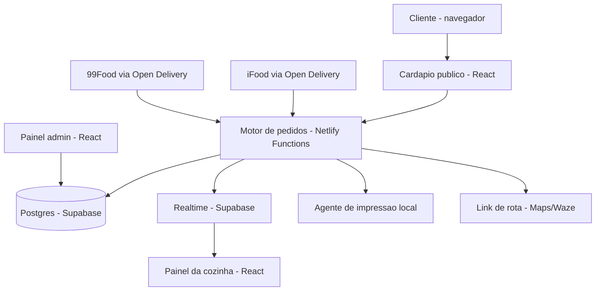

# Sistema Deguste Burguer — Planejamento

2026-09-18 · @Rafael Muniz

## Resumo executivo

O **Deguste Burguer** (Salvador/BA) é uma hamburgueria pequena — 1 chef (Bruno, CEO) + 1 administrador (Lucas Costa, Co-CEO) — que hoje opera com a **Cardápio Web** (ferramenta paga de terceiros) para gerenciar cardápio, pedidos (próprio + iFood + 99Food), impressão na cozinha e roteamento de entrega.

**Objetivo do projeto:** construir uma plataforma própria, gratuita e sob controle total do negócio, que substitua a Cardápio Web sem perder nenhuma capacidade operacional crítica — cardápio digital, gestão de pedidos multi-canal, impressão automática na cozinha, cálculo/roteamento de entrega e cadastro de produtos/ficha técnica.

**Por que é viável:** o volume é baixo (~1.000 pedidos/mês, ~33/dia), a equipe é mínima, e existem hoje serviços de infraestrutura com tiers gratuitos generosos o suficiente para cobrir esse volume sem custo de servidor. Os desafios reais não são de escala, e sim de **integração com o mundo físico** (impressora), **dinheiro** (Pix/pagamento) e **logística de entrega**.

### Equipe do projeto

| Nome | Papel |
| --- | --- |
| Bruno | CEO e Chef — comanda a cozinha, define cardápio e receitas |
| Lucas Costa | Co-CEO e Administrador — operação do dia a dia, financeiro, atendimento; também contribui no código em produção (ver fluxo de colaboração abaixo) |
| Rafael Muniz | CTO — arquitetura e desenvolvimento do sistema |

**Fluxo de colaboração:** Lucas Costa é iniciante em programação, mas vai atuar direto na produção do sistema — puxando o repositório via Git e abrindo pull requests, com apoio do **Claude Code** para escrever e revisar o código. Rafael Muniz (CTO) revisa e aprova os PRs antes do merge para a branch principal.

## Contexto do negócio (dados reais levantados)

**Instagram [@degusteburguer_](https://www.instagram.com/degusteburguer_/):** 1.336 seguidores, 182 posts. Bio: "Hamburgueria. Sem miséria! 🍔🤘". Funcionamento: **quarta a domingo, 18h às 22h** (janela de 4h/dia, 5 dias/semana). Delivery com localidades restritas ("consulte localidades"). Destaques fixos: *Degustadores*, *Making Of*, *Entregas*.

**Cardápio (via [app.cardapioweb.com/deguste_burguer](https://app.cardapioweb.com/deguste_burguer)):**

| Categoria | Itens | Faixa de preço |
| --- | --- | --- |
| Ofertas com Desconto | combos com desconto | variável |
| Smashs 90g Black Angus | 7 opções (ex.: Jackfino, Laurinha, Bolado, Xeque Mate) + monte-o-seu | R$ 21,99 – R$ 26,99 |
| Burguers 180g Black Angus | 8 opções (ex.: Padrão, Jackmelt, Boladão, Gorgonelson) + monte-o-seu | R$ 33,99 – R$ 37,99 |
| Entradas e Sobremesas | batatas, porções | não coletado em detalhe |
| Bebidas | refrigerantes (ex.: Coca-Cola lata) | não coletado em detalhe |

Ticket médio por item fica entre **R$ 22 e R$ 38** — condizente com hamburgueria de bairro, não um ticket alto.

**Funcionalidades observadas na loja pública:**
- Login/cadastro de cliente com **programa de cashback** (10% do valor do pedido em saldo para próximas compras)
- **Cupom de desconto** disponível na sacola
- Escolha entre **Entrega** ("a gente leva até você") e **Retirada** ("você retira no local"), com cálculo de taxa/tempo por endereço
- Loja fecha e abre por horário — pedidos bloqueados fora do expediente ("Estabelecimento fechado")
- Rodapé exibe CNPJ e endereço fixo (formalização simples, MEI ou similar)

**Canais de venda atuais:** cardápio próprio (link direto), iFood, 99Food — geridos hoje dentro da Cardápio Web.

## Engenharia reversa da Cardápio Web

O que a Cardápio Web resolve hoje para o Deguste Burguer, por camada:

| Camada | O que faz hoje | Equivalente a construir |
| --- | --- | --- |
| Cardápio público | Site com categorias, busca, produto com variações ("monte o seu"), abre/fecha por horário | Página de cardápio própria, dados vindos de um banco só nosso |
| Conta do cliente | Login, cashback (10% em saldo), cupons | Tabela de clientes + saldo de cashback + cupons simples |
| Pedido | Escolha entrega vs retirada, cálculo de taxa por distância | Motor de pedidos com 2 modos de entrega e cálculo de frete |
| Cozinha | Recebe pedido e **imprime automaticamente** numa impressora física | Ver seção "Problemas complexos" — este é o ponto crítico |
| Entrega | Gera link/rota para o entregador | Geração de link de rota (Google Maps/Waze) por pedido |
| Gestão de cardápio | CRUD de produtos, categorias, preços, ficha técnica | Painel admin simples (CRUD) |
| Multi-canal | Centraliza pedidos do site próprio + iFood + 99Food num só lugar | Integração via padrão **Open Delivery** (ver arquitetura) |
| Financeiro básico | Relatório de vendas do período | Relatório simples (soma por dia/semana/mês) |

**Conclusão da engenharia reversa:** não existe nenhuma funcionalidade "mágica" aqui — é a combinação de 6-7 peças relativamente simples bem integradas. A complexidade real da Cardápio Web está em suportar *milhares* de restaurantes diferentes ao mesmo tempo (multi-tenant, plano, faturamento, suporte). Para **um único restaurante**, cada peça individual é pequena.

## O que a Cardápio Web faz e não faz

### O que a Cardápio Web faz que a Deguste precisa
1. **Cardápio online** — cliente vê produtos, preços, fotos, adicionais e opções.
2. **Pedido direto** — cliente monta o pedido sem precisar passar pelo iFood.
3. **Pagamento online** — Pix, cartão etc.
4. **Gestão de pedidos** — pedidos entram automaticamente e ficam organizados por status.
5. **Integração com iFood e 99Food** — centralizar pedidos de diferentes canais.
6. **Gestão de delivery** — endereço, taxa de entrega, distância e organização das rotas.
7. **Controle de clientes** — nome, telefone, histórico de pedidos e frequência.
8. **Promoções** — cupons, desconto na primeira compra, cashback e promoções específicas.
9. **Gestão financeira** — faturamento, ticket médio, vendas por canal, custos e margem.
10. **Relatórios** — produtos mais vendidos, horários de pico, clientes recorrentes etc.
11. **Banco de dados próprio** — a Deguste mantém os dados dos clientes dos pedidos próprios.
12. **Painel administrativo** — Bruno e Lucas conseguem controlar cardápio, pedidos, clientes, estoque e financeiro em um único lugar.
13. **Automação** — copiar pedidos.
14. **Ficha técnica dos produtos** — saber exatamente quanto de pão, carne, queijo, molho etc. cada hambúrguer consome.
15. **Gestão dos motoboys** — distribuir pedidos, organizar rotas, acompanhar entregas e calcular quanto cada entregador deve receber.

### O que a Cardápio Web não faz e que a Deguste precisa
1. Enviar mensagens automáticas de atualização de status do pedido apenas pelo WhatsApp (ex.: "Seu pedido foi aceito" e "Seu pedido está a caminho")
2. Puxar a localização do cliente, se permitido.
3. Identificar corretamente os itens do cardápio no relatório de vendas (combos em que o cliente escolhe o hambúrguer e o pedido do hambúrguer individual não se conversam; o mesmo hambúrguer vendido em plataformas diferentes também deve ser contabilizado junto)

## Escopo funcional

**MVP (substitui o essencial da Cardápio Web):**

- [ ] Cardápio público (categorias, produtos, variações "monte o seu", fotos)
- [ ] Loja abre/fecha automaticamente por horário (qua–dom, 18h–22h configurável)
- [ ] Pedido com escolha entrega/retirada + cálculo de taxa por distância
- [ ] Pix na hora do pedido (QR code via gateway)
- [ ] Notificação instantânea de pedido novo para a cozinha (tela ou som)
- [ ] Impressão automática do pedido na impressora térmica existente
- [ ] Painel admin: CRUD de produtos/categorias/preços
- [ ] Geração de link de rota para o entregador

**Fase 2 (paridade com o que eles usam no dia a dia):**

- [ ] Conta de cliente + programa de cashback (10%)
- [ ] Cupons de desconto
- [ ] Relatório de vendas (dia/semana/mês)
- [ ] Histórico de pedidos por cliente (telefone/WhatsApp)

**Fase 3 (opcional, só se o negócio crescer):**

- [ ] Integração direta com iFood/99Food via Open Delivery (ver seção de arquitetura)
- [ ] Ficha técnica / controle de estoque de insumos
- [ ] Emissão de nota fiscal (via serviço terceirizado)

**Fora de escopo por ora:** multi-loja, apps nativos (celular), fidelidade sofisticada, módulo fiscal completo construído do zero.

## Arquitetura técnica

Monolito único, sem multi-tenant (é uma loja só). Acessado pelo navegador, como SPA em React — sem app nativo.

**Stack escolhida:**

| Camada | Ferramenta | Motivo |
| --- | --- | --- |
| Frontend (cardápio + admin + cozinha) | React + Vite + React Router | SPA leve; ecossistema React puro (sem framework tipo Next.js, já que a ideia é testar React "cru" fora do Nuxt/Vue do dia a dia) |
| Backend | Netlify Functions (serverless) | Sem servidor dedicado; escala e faz deploy junto com o front no mesmo repositório |
| Banco de dados | Supabase (Postgres) | Free tier cobre bem 1.000 pedidos/mês; auth e realtime já inclusos |
| Tempo real (pedido → cozinha) | Supabase Realtime | Incluso no Supabase, sem peça extra |
| Hospedagem | Netlify | Free tier generoso; deploy contínuo direto do Git |
| Pix | Mercado Pago ou Pagar.me (API) | Sem mensalidade, só taxa por transação |
| Impressão | Agente local (programa no PC/tablet da cozinha) que escuta a API e envia para a impressora | Ver seção de problemas complexos |

**Observação sobre o backend:** como é React puro (Vite), o roteamento de páginas fica a cargo do React Router, e toda lógica de servidor (criar pedido, calcular frete, gerar Pix, notificar cozinha) vira uma função Netlify separada — nada de API routes de framework, é tudo função serverless simples.

**Modelo de dados (núcleo):** `produtos`, `categorias`, `variacoes_produto`, `pedidos`, `itens_pedido`, `clientes`, `cupons`, `configuracoes_loja` (horário, taxa de entrega). Simples, uma tabela por conceito, sem necessidade de `loja_id` (é uma loja só) — mas mantendo a possibilidade de adicionar depois sem reescrever tudo.

## Problemas complexos a resolver

### 1. Impressora física na cozinha

A API não fala direto com uma impressora térmica USB/Bluetooth. Solução padrão do mercado: um **agente local** — um programinha leve (Node.js ou Python) rodando no computador/tablet da cozinha, que:

1. Fica conectado à API (via WebSocket ou polling a cada poucos segundos)
2. Quando chega pedido novo, formata um recibo (ESC/POS, o protocolo universal de impressoras térmicas)
3. Envia para a impressora local

Bibliotecas prontas: `node-thermal-printer` (Node.js) resolve a maior parte disso sem reinventar o protocolo.

### 2. Pagamento (Pix)

Não envolve segurar dinheiro — um gateway (Mercado Pago, Pagar.me) gera o QR code Pix e avisa via **webhook** quando o cliente paga. O sistema só escuta esse webhook e marca o pedido como pago. Risco a evitar: nunca manipular dados de cartão diretamente — sempre delegar ao gateway (PCI compliance).

### 3. Roteamento de entrega

A Cardápio Web gera um link de rota. Isso é simples de replicar: ao aceitar o pedido, gerar um link `https://www.google.com/maps/dir/?api=1&destination=<endereço>` e enviar pro entregador via WhatsApp. Não precisa de app de entregador dedicado nesse volume.

### 4. Integração iFood/99Food

Este é o mais trabalhoso. Caminho recomendado: usar o padrão **Open Delivery** (desenvolvido pela Abrasel com mais de 100 desenvolvedores de sistemas de restaurante), que padroniza a comunicação com múltiplos marketplaces numa única integração. Alternativa mais simples para começar: manter o gerenciador de pedidos do próprio iFood/99Food separado por um tempo, e só migrar essa parte depois que o resto estiver estável — não é bloqueante para o MVP.

### 5. Cálculo de taxa de entrega por distância

API de geocoding + distância (ex.: OpenRouteService, que tem tier gratuito, ou a Distance Matrix do Google com cota grátis) para calcular km entre a loja e o endereço do cliente, aplicando uma tabela simples de R$/km ou faixas de bairro.

## Custos estimados

| Item | Custo | Observação |
| --- | --- | --- |
| Hospedagem (Netlify) | R$ 0 | Free tier cobre 1.000 pedidos/mês com folga |
| Banco de dados (Supabase) | R$ 0 | Free tier: 500MB–1GB, mais que suficiente |
| Domínio próprio | ~R$ 40/ano | Opcional; dá pra usar subdomínio grátis no início |
| Gateway Pix (Mercado Pago/Pagar.me) | ~1% por transação | Proporcional à venda, não é custo fixo |
| Agente de impressão | R$ 0 | Roda no computador que já existe na cozinha |
| API de distância/geocoding | R$ 0 | Dentro da cota gratuita nesse volume |

**Total fixo mensal: R$ 0.** O único custo real é a taxa do Pix, que já seria cobrada de qualquer forma em qualquer meio de pagamento digital — não é um custo *do sistema*, é um custo do negócio.

## Roadmap

| Fase | Entrega | Depende de |
| --- | --- | --- |
| 1. Fundação | Projeto React+Vite no Netlify, banco Supabase modelado, CRUD de produtos no admin | — |
| 2. Cardápio público | Página de cardápio funcionando, categorias, produtos, variações | Fase 1 |
| 3. Pedido básico | Fluxo completo: cliente monta pedido → escolhe entrega/retirada → Pix → pedido salvo | Fase 2 |
| 4. Cozinha em tempo real | Painel da cozinha recebendo pedido via Supabase Realtime + impressão automática | Fase 3 |
| 5. Substituição real | Loja passa a usar o sistema novo no dia a dia, Cardápio Web em paralelo por 1-2 semanas como rede de segurança | Fase 4 |
| 6. Extras | Cashback, cupons, relatórios, link de rota para entregador | Fase 5 estável |
| 7. (Opcional) Marketplaces | Integração iFood/99Food via Open Delivery | Negócio validado no sistema próprio |

A fase 5 é o marco mais importante: é quando o amigo para de pagar a Cardápio Web de fato.

## Riscos e problemas prováveis

### Financeiros

- **Comissão do marketplace não muda.** Trocar a Cardápio Web pelo sistema próprio elimina a mensalidade da ferramenta, mas **não** elimina a comissão que iFood e 99Food cobram por pedido (tipicamente 12%–27%, dependendo do plano) — isso é entre o Deguste Burguer e o marketplace, independe de qual sistema gerencia o pedido.
- **Taxa do Pix é proporcional, mas existe.** Num ticket médio de R$22–38, ~1% de taxa é pequeno em reais, mas precisa entrar na precificação — hoje pode já estar embutido no preço via Cardápio Web e ninguém ter reparado.
- **Manutenção não é gratuita, mesmo sem custo de servidor.** O trabalho do Rafael tem custo de oportunidade — se o projeto crescer, pode chegar um ponto em que vale mais pagar por manutenção do que continuar de favor.
- **Free tiers têm teto.** Supabase e Netlify grátis cobrem 1.000 pedidos/mês com folga, mas se o negócio crescer (ex.: 5.000+ pedidos/mês, mais fotos/imagens armazenadas), pode haver custo real de upgrade — não é zero pra sempre, é zero *nesse volume*.

### Estruturais / operacionais

- **Ponto único de manutenção.** Hoje só o Rafael entende o sistema. Se ele estiver indisponível (viagem, outro trabalho, imprevisto) e algo quebrar num sábado de pico, não há suporte 24/7 como o da Cardápio Web — precisa de um plano B (documentação básica, ou alguém de backup).
- **Sem SLA formal.** Uma empresa paga responde por indisponibilidade; um sistema caseiro não tem ninguém a cobrar se cair.
- **Dependência de internet do local.** É uma casa, não um estabelecimento comercial dedicado — se a conexão cair, cardápio, pedidos e impressão param juntos. Vale ter um plano de contingência (ex.: WhatsApp manual como fallback).
- **Falha de hardware sem redundância.** Impressora com defeito, tablet da cozinha sem bateria, agente de impressão travado — sem um segundo caminho, o pedido não sai.
- **Backup e recuperação de dados.** Supabase tem backups, mas o processo de restaurar (se dados forem corrompidos ou apagados por engano) precisa ser testado antes de precisar de verdade.
- **Conformidade fiscal.** Sem módulo fiscal, a emissão de nota continua manual/externa — isso é risco de multa se o volume crescer e a Receita passar a exigir mais rigor.

### Por plataforma

| Canal | Risco específico |
| --- | --- |
| **iFood** | Documentação e homologação de integrações de terceiros costuma ter processo de aprovação; a API pode mudar sem aviso extenso; pedido cancelado/alterado direto no app do iFood pode não sincronizar de volta pro sistema próprio (mesmo problema que a 99Food tem hoje, visto na documentação da Cardápio Web) |
| **99Food** | Cobertura geográfica mais restrita ("disponível apenas em cidades atendidas"); menor volume de pedidos tende a tornar a manutenção da integração menos prioritária, mas o risco técnico é o mesmo do iFood |
| **Atendimento direto (site/WhatsApp)** | Aqui não tem rede de segurança de terceiro — se o sistema cair, o pedido só existe se o cliente ligar/mandar mensagem manualmente; é o canal onde a responsabilidade é 100% do Deguste Burguer, sem marketplace como intermediário |

**Mitigação geral sugerida:** manter um canal manual de emergência (WhatsApp do próprio número, como já é hoje) sempre disponível como fallback em qualquer um dos três canais, pelo menos até o sistema provar estabilidade por alguns meses.

## Segurança e conformidade legal

### LGPD (Lei Geral de Proteção de Dados)

O sistema coleta dados pessoais (nome, telefone, endereço, e-mail se houver conta) — isso exige base legal clara para o tratamento e mecanismo para o cliente solicitar exclusão dos seus dados a qualquer momento.

### Políticas e páginas do site

- [ ] Política de Privacidade (o que é coletado, pra quê, por quanto tempo)
- [ ] Termos de Uso (regras do pedido, responsabilidades, forma de pagamento)
- [ ] Aviso/banner de Cookies (consentimento antes de gravar cookies não essenciais)
- [ ] FAQ (perguntas frequentes: prazos, formas de pagamento, área de entrega, trocas)
- [ ] Política de Trocas/Cancelamento (regras específicas de comida — geralmente não há reembolso após preparo iniciado)

### Acessibilidade

- Contraste de cores adequado, texto alternativo em todas as fotos de produto
- Navegação e formulário do pedido usáveis por teclado, não só por mouse/toque
- Tamanho de fonte legível por padrão (a maioria dos clientes acessa pelo celular)

### Segurança técnica

- HTTPS obrigatório em todo o site (Netlify já fornece automaticamente, sem configuração extra)
- Nunca armazenar dados de cartão no próprio sistema — sempre delegado ao gateway de pagamento (Mercado Pago/Pagar.me)
- Supabase Row Level Security (RLS) ativado desde o início, mesmo sendo uma loja só, para evitar exposição acidental de dados de clientes por erro de configuração
- Chaves de API e segredos apenas em variáveis de ambiente do Netlify — nunca no código-fonte versionado no Git (importante já que Lucas vai puxar o repositório)
- Rate limiting básico nas funções serverless, para evitar spam de pedidos falsos ou abuso do cupom/cashback
- Backup periódico dos dados (o próprio Supabase mantém isso no free tier, com retenção limitada)

### Cookies

O site usa cookies de sessão (carrinho, login) — exige banner de consentimento antes de qualquer cookie não essencial. Evitar cookies de terceiros (ex.: analytics de rastreamento) ou, se usados, declará-los explicitamente na política de privacidade.

## Próximos passos imediatos

1. Criar projeto Vite+React e repositório Git conectado ao Netlify (deploy automático a cada push)
2. Criar projeto no Supabase e desenhar as tabelas do núcleo (`produtos`, `categorias`, `pedidos`, `itens_pedido`)
3. Levantar o cardápio completo real (fotos, descrições e preços de todas as categorias — hoje só "Smashs" e "Burguers 180g" foram mapeados em detalhe; faltam "Entradas e Sobremesas", "Bebidas" e "Ofertas com Desconto")
4. Confirmar com o amigo: qual impressora térmica eles usam hoje (modelo/marca) — define qual biblioteca ESC/POS usar no agente local
5. Escolher o gateway de Pix (Mercado Pago vs Pagar.me) e criar conta de teste (sandbox)
6. Definir a data de corte: até quando rodar os dois sistemas em paralelo antes de cancelar a Cardápio Web
